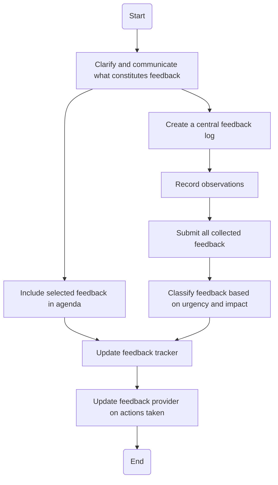

### Analysis

1. **Process Name**: Feedback Mechanisms

2. **Roles (Swimlanes)**:
   - Maintenance Director
   - Maintenance Manager
   - Technician
   - Maintenance Supervisor

3. **Steps Extracted into Table**:

| Step # | Role                | Action                                                                 | Next Step/Logic                      |
|--------|---------------------|------------------------------------------------------------------------|--------------------------------------|
| 1      | Maintenance Director| Clarify and communicate what constitutes feedback.                    | Step 2                               |
| 2      | Maintenance Manager | Create a central feedback log and provide access to all maintenance staff. | Step 3                          |
| 3      | Technician          | Record observations either on Google forms or during meetings.        | Step 4                               |
| 4      | Maintenance Supervisor | Submit all collected feedback to Planner or Engineer for recording. | Step 5                          |
| 5      | Maintenance Manager | Classify feedback based on urgency and impact.                        | Step 7                               |
| 6      | Maintenance Director| Include selected feedback in agenda and assign corrective actions.    | Step 7                               |
| 7      | Maintenance Manager | Update feedback tracker with action taken, owner, target date, and status. | Step 8                         |
| 8      | Maintenance Supervisor | Update feedback provider on actions taken.                          | End                                  |

4. **Mermaid.js Code Block**:

This code provides a visual representation of the flowchart using Mermaid.js, capturing the logical sequence and decision points between steps.