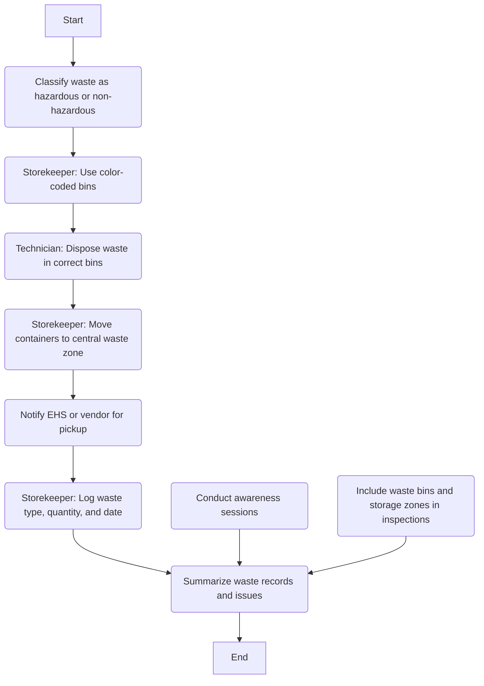

### Analysis

1. **Process Name**: Waste Management

2. **Roles (Swimlanes)**:
   - EHS Officer
   - Maintenance
   - Technician
   - Safety Officer

3. **Steps Table**

```markdown
| Step # | Role        | Action                                                                                 | Next Step/Logic                                          |
|--------|-------------|----------------------------------------------------------------------------------------|----------------------------------------------------------|
| 1      | EHS Officer | Classify waste as hazardous (e.g., oil, chemicals) or non-hazardous (e.g., scrap).     | Step 2                                                   |
| 2      | Maintenance | Storekeeper uses color-coded bins or drums for different waste types (oil, filters, etc.) | Step 3                                                   |
| 3      | Technician  | Ensure technicians dispose of waste immediately after job completion in correct bins.  | Step 4                                                   |
| 4      | Maintenance | Storekeeper moves filled containers to central waste zone using sealed drums, trays, or trolleys. | Step 5                                                   |
| 5      | Maintenance | Notify EHS or authorized vendor for scheduled pickup of hazardous or recyclable waste. | Step 6                                                   |
| 6      | Maintenance | Storekeeper logs waste type, quantity, and date in a manual register or tracking sheet. | Step 9                                                   |
| 7      | Safety Officer | Conduct awareness sessions on what waste goes where and why it matters.     | Step 9                                                   |
| 8      | EHS Officer | Include waste bins and storage zones in weekly shop floor safety/environmental inspections. | Step 9                                                   |
| 9      | Maintenance | Summarize waste records and issues in monthly maintenance and safety meetings.         | End                                                     |
```

4. **Mermaid.js Code Block**

