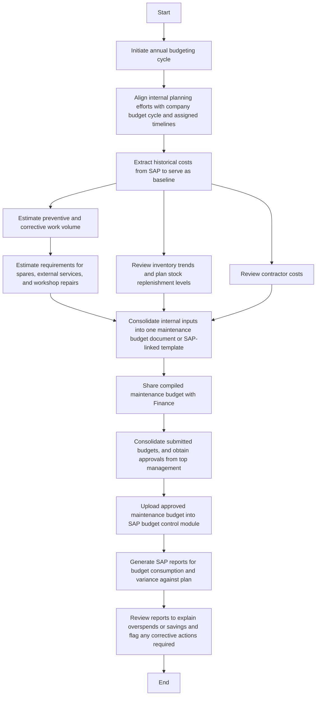

### Analysis of the Flowchart

#### 1. Process Name
- Budgeting

#### 2. Roles (Swimlanes)
- Finance
- Maintenance
- SAP/PM Administrator
- Stores Team

#### 3. Markdown Table

| Step # | Role                  | Action                                                                               | Next Step/Logic                   |
|--------|-----------------------|--------------------------------------------------------------------------------------|-----------------------------------|
| 1      | Finance               | Initiate annual budgeting cycle                                                      | Step 2                            |
| 2      | Maintenance           | Align internal planning efforts with company budget cycle and assigned timelines     | Step 3                            |
| 3      | SAP/PM Administrator  | Extract historical costs from SAP to serve as baseline                               | Step 4                            |
| 4      | Maintenance           | Estimate preventive and corrective work volume                                       | Step 5                            |
| 5      | Maintenance           | Estimate requirements for spares, external services, and workshop repairs            | Step 8                            |
| 6      | Stores Team           | Review inventory trends and plan stock replenishment levels                          | Step 8                            |
| 7      | Maintenance           | Review contractor costs                                                              | Step 8                            |
| 8      | Maintenance           | Consolidate internal inputs into one maintenance budget document or SAP-linked template | Step 9                            |
| 9      | Finance               | Share compiled maintenance budget with Finance                                       | Step 10                           |
| 10     | Finance               | Consolidate submitted budgets, and obtain approvals from top management              | Step 11                           |
| 11     | SAP/PM Administrator  | Upload approved maintenance budget into SAP budget control module                     | Step 12                           |
| 12     | SAP/PM Administrator  | Generate SAP reports for budget consumption and variance against plan                | Step 13                           |
| 13     | SAP/PM Administrator  | Review reports to explain overspends or savings and flag any corrective actions required | End                              |

#### 4. Mermaid.js Code Block

