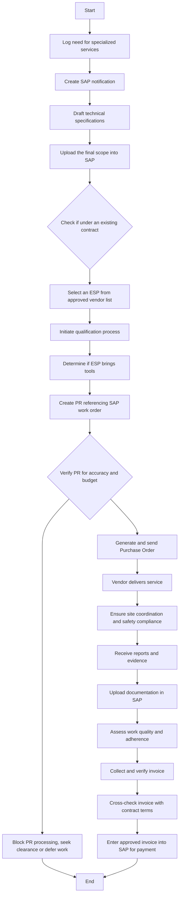

Here is the analysis of the provided flowchart image:

### 1. Process Name
External Service Provider

### 2. Roles (Swimlanes)
- Maintenance
- Supervisor
- SAP PM Administrator
- Procurement Department
- Finance
- External Service Provider

### 3. Steps in a Markdown Table

| Step # | Role                   | Action                                                                                          | Next Step/Logic                    |
|--------|------------------------|-------------------------------------------------------------------------------------------------|------------------------------------|
| 1      | Maintenance            | Log need for specialized services (e.g., calibration, NDT, overhaul).                           | 2                                  |
| 2      | Supervisor             | Create SAP notification tagged as requiring external services.                                  | 3                                  |
| 3      | Maintenance            | Draft technical specifications, safety requirements, and expected deliverables.                 | 4                                  |
| 4      | SAP PM Administrator   | Upload the final scope into SAP for reference in PR and PO generation.                          | 5                                  |
| 5      | Procurement Department | Check if the service provider is operating under an existing contract.                         | 6                                  |
| 6      | Procurement Department | Select an ESP from the approved vendor list based on type of service and past performance.       | 7                                  |
| 7      | Procurement Department | Initiate qualification process: collect documents, assess technical/commercial capacity, onboard in SAP. | 8                                  |
| 8      | Maintenance            | Determine whether the ESP will bring their own consumables/tools, and document in SOW.         | 9                                  |
| 9      | Maintenance            | Create PR referencing SAP work order and scope.                                                 | 10                                 |
| 10     | Maintenance            | Verify PR for accuracy, scope, and budget availability.                                         | 11 (if no budget), 12 (if budget)  |
| 11     | Maintenance            | Block PR processing if no budget is available. Seek finance clearance or defer work.           | End                                |
| 12     | Finance / Maintenance  | Generate and send Purchase Order to vendor.                                                    | 13                                 |
| 13     | External Service Provider | Vendor delivers service as per contract and scope.                                               | 14                                 |
| 14     | Maintenance            | Ensure site coordination and compliance with safety and quality protocols.                     | 15                                 |
| 15     | Maintenance            | Receive calibration reports, inspection certificates, and completion evidence.                 | 16                                 |
| 16     | SAP PM Administrator   | Upload all service documentation in SAP for traceability.                                      | 17                                 |
| 17     | Maintenance            | Assess work based on timeliness, quality, communication, and safety adherence using a standardized form. | 18                                 |
| 18     | Finance / Maintenance  | Collect invoice and verify it against PO and actual work completed.                            | 19                                 |
| 19     | Maintenance            | Cross-check invoice with performance, documentation, and contract terms.                       | 20                                 |
| 20     | Maintenance            | Enter approved invoice into SAP and process for payment.                                       | End                                |

### 4. Mermaid.js Code Block

