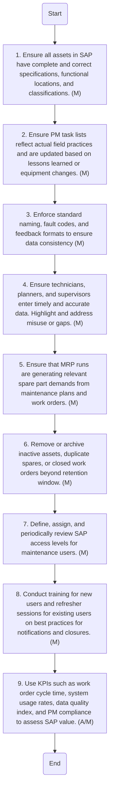

### Analysis of CMMS Maintenance and Governance Flowchart

#### 1. Process Name:
- CMMS Maintenance and Governance

#### 2. Roles (Swimlanes):
- SAP PM Administrator
- Maintenance

#### 3. Steps Table:

| Step # | Role                | Action                                                                                                  | Next Step/Logic |
|--------|---------------------|---------------------------------------------------------------------------------------------------------|-----------------|
| 1      | SAP PM Administrator | Ensure all assets in SAP have complete and correct specifications, functional locations, and classifications. (M) | 2               |
| 2      | Maintenance          | Ensure PM task lists reflect actual field practices and are updated based on lessons learned or equipment changes. (M) | 3               |
| 3      | SAP PM Administrator | Enforce standard naming, fault codes, and feedback formats to ensure data consistency (M)                | 4               |
| 4      | Maintenance          | Ensure technicians, planners, and supervisors enter timely and accurate data. Highlight and address misuse or gaps. (M) | 5               |
| 5      | SAP PM Administrator | Ensure that MRP runs are generating relevant spare part demands from maintenance plans and work orders. (M) | 6               |
| 6      | SAP PM Administrator | Remove or archive inactive assets, duplicate spares, or closed work orders beyond retention window. (M)   | 7               |
| 7      | SAP PM Administrator | Define, assign, and periodically review SAP access levels for maintenance users. (M)                     | 8               |
| 8      | SAP PM Administrator | Conduct training for new users and refresher sessions for existing users on best practices for notifications and closures. (M) | 9               |
| 9      | SAP PM Administrator & Maintenance | Use KPIs such as work order cycle time, system usage rates, data quality index, and PM compliance to assess SAP value. (A/M) | End             |

#### 4. Mermaid.js Code Block:

