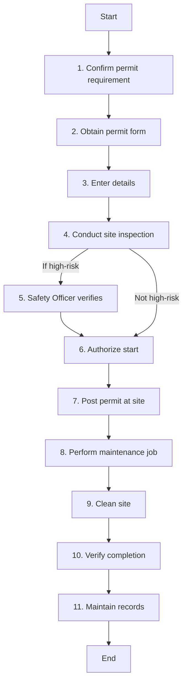

### Analysis

#### 1. Process Name
- **Work Permit**

#### 2. Roles (Swimlanes)
- Maintenance
- Technicians
- Safety Officer
- Permit Authorizing Officer

#### 3. Steps in Markdown Table

| Step # | Role                     | Action                                                                                     | Next Step/Logic         |
|--------|--------------------------|--------------------------------------------------------------------------------------------|-------------------------|
| 1      | Maintenance              | Based on the job type, location, and risk level, confirm whether a permit is required.     | 2                       |
| 2      | Technicians              | Obtain the correct type of permit form from the permit issuing authority or SAP system.    | 3                       |
| 3      | Maintenance              | Enter details.                                                                             | 4                       |
| 4      | Maintenance              | Conduct a site inspection to confirm all controls are in place before approving the permit.| 5 (If high-risk, else 6)|
| 5      | Safety Officer           | For high-risk tasks, verify controls and sign the permit.                                  | 6                       |
| 6      | Permit Authorizing Officer | Sign the permit and authorize the start of the job.                                       | 7                       |
| 7      | Technicians              | Permit must be posted visibly at the work location until task completion.                  | 8                       |
| 8      | Maintenance              | Perform the maintenance job. Monitor safety compliance and intervene.                      | 9                       |
| 9      | Maintenance              | Clean the site, remove isolations, tools, and materials.                                   | 10                      |
| 10     | Maintenance              | Verify job completion and safe condition of equipment. Archive permit.                     | 11                      |
| 11     | Maintenance              | Maintain a record of all issued permits for traceability, audit, and learning.             | End                     |

#### 4. Mermaid.js Code Block

