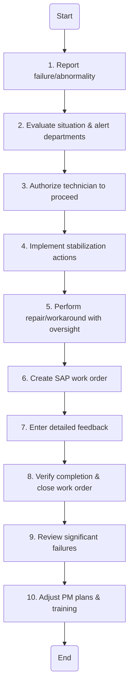

### 1. Process Name
Emergency Response Procedure

### 2. Roles (Swimlanes)
- Technician
- Maintenance

### 3. Flowchart Steps

| Step # | Role        | Action                                                                                               | Next Step/Logic |
|--------|-------------|------------------------------------------------------------------------------------------------------|-----------------|
| 1      | Technician  | Any equipment failure or critical abnormality is immediately reported.                               | 2               |
| 2      | Maintenance | Evaluates the situation for safety and operational impact, then alerts concerned departments.         | 3               |
| 3      | Maintenance | Authorizes the technician to proceed, subject to safety clearance and risk checks.                   | 4               |
| 4      | Maintenance | Implement temporary isolation, tagging, or containment actions to stabilize the situation.           | 5               |
| 5      | Maintenance | Carry out necessary repair or workaround under supervisor oversight, ensuring safety protocols.      | 6               |
| 6      | Maintenance | After stabilizing, create a SAP work order for documentation and closure tracking.                  | 7               |
| 7      | Maintenance | Enters detailed feedback on actions taken, materials used, time, and observations.                   | 8               |
| 8      | Maintenance | Supervisor verifies completion, accuracy of feedback, and closes the emergency work order in SAP.    | 9               |
| 9      | Maintenance | Significant failures reviewed for root causes and potential preventive actions.                      | 10              |
| 10     | Maintenance | Adjust PM plans, inspection frequencies, or training needs based on learnings.                       | End             |

### 4. Mermaid.js Code Block

