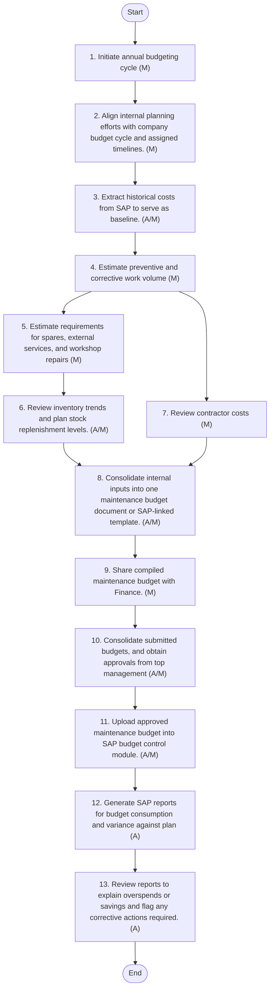

## Budgeting

Introduction and Background of the Section
Effective budgeting is essential to ensure that the Maintenance Department at Arabian Mills is adequately resourced for executing preventive, corrective, and reliability-centered activities throughout the year. A structured budgeting process enables cost control, supports capital and operational planning, and ensures alignment with corporate financial goals.
The budgeting process is built upon historical maintenance data, projected workloads, equipment reliability trends, and input from SAP Plant Maintenance. It involves collaboration among maintenance, finance, and procurement functions, and ensures that sufficient provisions are made for spares, contractor services, and unplanned failures. Budget performance is reviewed monthly using SAP-generated variance analysis reports.
Policy
 The maintenance budget shall be prepared annually, incorporating inputs from all relevant maintenance functions.
 This maintenance budget serves as a subcomponent of the company-wide consolidated budget, which is finalized by the Finance Department.
 All budget assumptions and guidelines shall follow the timeline, strategic priorities, and instructions issued by Finance.
 The SAP system shall be used to extract historical maintenance cost data, forecast needs, track budget consumption, and perform variance analysis.
 All cost components—including spares, manpower, contractor services, and capital maintenance—shall be forecasted systematically.
 Variances between actual and budgeted expenses shall be reviewed monthly, with corrective actions taken if required.
 Budget revisions, if necessary, must be formally approved and documented.
Procedure Breakdown

| S. No. | Procedure Description | Responsibility | Frequency |
| --- | --- | --- | --- |
| 1 | **Budget Cycle Initiation** • Initiate annual budgeting cycle and issue planning calendar, guidelines, and strategic assumptions. | Finance Department | Annual |
| 2 | **Maintenance Budget Planning Kick-off** • Align internal planning efforts with company budget cycle and assigned timelines. | Maintenance Director | Annual |
| 3 | **Historical Data Extraction** • Extract historical costs (work orders, spares, contractor services) from SAP to serve as baseline. | SAP PM Administrator | Annual |
| 4 | **Workload Forecasting** • Estimate preventive and corrective work volume for the upcoming period using SAP history and planner inputs. | Maintenance Planner | Annual |
| 5 | **Cost Assumption Inputs** • Estimate requirements for spares, external services, and workshop repairs based on past usage and anticipated projects. | Maintenance Manager | Annual |
| 6 | **Stores & Spares Budget Estimation** • Review inventory trends and plan stock replenishment levels. | Stores Team | Annual |
| 7 | **External Services Budget Estimation** • Review contractor costs for calibration, repair services, and technical audits. | Maintenance Manager | Annual |
| 8 | **Budget Compilation** • Consolidate internal inputs into one maintenance budget document or SAP-linked template. | Maintenance Manager | Annual |
| 9 | **Budget Submission to Finance** • Share compiled maintenance budget with Finance for integration into the company-wide budget. | Maintenance Director | Annual |
| 10 | **Budget Consolidation and Finalization** • Consolidate submitted budgets, perform company-level analysis, and obtain approvals from top management. | Finance Department | Annual |
| 11 | **SAP Budget Upload** • Upload approved maintenance budget into SAP budget control module. | Finance Department | Annual |
| 12 | **Monthly Budget Tracking Reports** • Generate SAP reports for budget consumption and variance against plan. | SAP PM Administrator | Monthly |
| 13 | **Budget Analysis and Variance Interpretation** • Review reports to explain overspends or savings and flag any corrective actions required. | Maintenance Director | Monthly |

Roles and Responsibilities

| Role | Responsibilities |
| --- | --- |
| Maintenance Director | Leads budgeting, coordinates departmental input, reviews accuracy, and tracks compliance |
| Maintenance Planner | Forecasts job volumes and cost implications based on SAP work orders |
| Maintenance Manager | Identifies major cost drivers, improvement projects, and upcoming workload |
| Stores Team | Provides usage history and unit cost data for consumables and critical spares |
| External Services Coordinator | Estimates contractor-based expenses and confirms service terms |
| Finance Department | Integrates maintenance budget into corporate planning and validates allocations |
| SAP PM Administrator | Ensures budget fields are correctly updated and reports are configured |

**[Diagram — PNG]:**

**Process Name:** Budgeting  

**Roles / Swimlanes:**
- Finance
- Maintenance
- SAP PM Administrator
- Stores Team

### Steps

| Step # | Role | Action | Decision/Next Step |
|--------|------|--------|--------------------|
| Start | Finance | Start | Proceed to step 1. |
| 1 | Finance | 1. Initiate annual budgeting cycle (M) | Proceed to step 2. |
| 2 | Maintenance | 2. Align internal planning efforts with company budget cycle and assigned timelines. (M) | Proceed to step 3. |
| 3 | SAP PM Administrator | 3. Extract historical costs from SAP to serve as baseline. (A/M) | Proceed to step 4. |
| 4 | Maintenance | 4. Estimate preventive and corrective work volume (M) | Proceed in parallel to steps 5 and 7. |
| 5 | Maintenance | 5. Estimate requirements for spares, external services, and workshop repairs (M) | Proceed to step 6. |
| 6 | Stores Team | 6. Review inventory trends and plan stock replenishment levels. (A/M) | Proceed to step 8. |
| 7 | Maintenance | 7. Review contractor costs (M) | Proceed to step 8. |
| 8 | Maintenance | 8. Consolidate internal inputs into one maintenance budget document or SAP-linked template. (A/M) | Proceed to step 9. |
| 9 | Maintenance | 9. Share compiled maintenance budget with Finance. (M) | Proceed to step 10. |
| 10 | Finance | 10. Consolidate submitted budgets, and obtain approvals from top management (A/M) | Proceed to step 11. |
| 11 | Finance | 11. Upload approved maintenance budget into SAP budget control module. (A/M) | Proceed to step 12. |
| 12 | SAP PM Administrator | 12. Generate SAP reports for budget consumption and variance against plan (A) | Proceed to step 13. |
| 13 | Maintenance | 13. Review reports to explain overspends or savings and flag any corrective actions required. (A) | Proceed to End. |
| End | Maintenance | End | Process completed. |

There are no explicit Yes/No decision branches shown in this flowchart.

