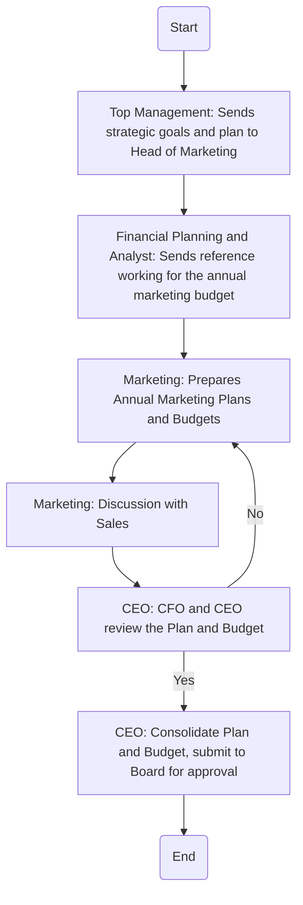

### Analysis

1. **Process Name**: Marketing Planning and Budgeting

2. **Roles (Swimlanes)**:
   - Top Management
   - Financial Planning and Analyst
   - Marketing
   - CEO

3. **Steps in Markdown Table**

| Step # | Role                       | Action                                                                                         | Next Step/Logic           |
|--------|----------------------------|------------------------------------------------------------------------------------------------|---------------------------|
| 1      | Top Management             | Sends the strategic goals and plan of the organization to the Head of Marketing. (M)           | Step 2                    |
| 2      | Financial Planning and Analyst | Sends the reference working for the annual marketing budget for the next fiscal year to the Head of Marketing. (M) | Step 3                    |
| 3      | Marketing                  | Prepares Annual Marketing Plans and Budgets. (M)                                               | Step 4                    |
| 4      | Marketing                  | Discussion with Sales.                                                                         | Step 5                    |
| 5      | CEO                        | The CFO and CEO review the Plan and Budget. (M)                                                | Decision (Plan Approved?) |
| Decision | -                        | Plan and Budget Approved?                                                                      | Yes: Step 6 / No: Step 3  |
| 6      | CEO                        | Consolidate Plan and Budget as part of the annual budget pack and submitted to Board for approval. (M) | End                       |

4. **Mermaid.js Code Block**

