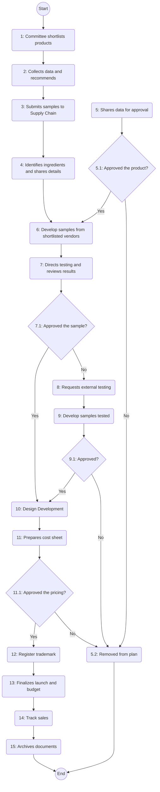

### Analysis of the Flowchart

#### 1. Process Name:
- New Product Development Process

#### 2. Roles (Swimlanes):
- NPD Committee
- Marketing
- Supply Chain
- F & D Cooking Department

#### 3. Steps Extracted into a Markdown Table:

| Step # | Role          | Action                                                                                                | Next Step/Logic    |
|--------|---------------|-------------------------------------------------------------------------------------------------------|--------------------|
| 1      | NPD Committee | Committee shortlists products proposed by Head of Marketing for conducting detail study.               | Step 2             |
| 2      | Marketing     | Collects category and competitor data. Reviews data together and recommends suggestions.               | Step 3             |
| 3      | Marketing     | Submits all competitors' samples and recommended benchmark product to Head of Supply Chain.            | Step 4             |
| 4      | Supply Chain  | Identifies ingredients and its sourcing methods with Head of Marketing and shares details.             | Step 6             |
| 5      | Marketing     | Shares all underlying new product data to CFO and CEO for review and final approval.                   | Step 5.1 Decision  |
| 5.1    | Decision      | Approved the product?                                                                                 | Yes: Step 6, No: Step 5.2 |
| 5.2    | Marketing     | Removed from the new product development plan.                                                        | End                |
| 6      | Marketing     | Develop samples from shortlisted vendors.                                                             | Step 7             |
| 7      | NPD Committee | Directs concerned departments to perform testing of the product samples and reviews the results.       | Step 7.1 Decision  |
| 7.1    | Decision      | Approved the sample?                                                                                  | Yes: Step 10, No: Step 8 |
| 8      | Marketing     | Requests Head of Supply Chain to procure given quantity of product for external testing.               | Step 9             |
| 9      | Marketing     | Developed samples are tested with target consumers.                                                   | Step 9.1 Decision  |
| 9.1    | Decision      | Approved?                                                                                             | Yes: Step 10, No: Step 5.2 |
| 10     | F & D Cooking | Design Development.                                                                                   | Step 11            |
| 11     | Marketing     | Prepares cost sheet. The CFO reviews the cost sheet.                                                  | Step 11.1 Decision |
| 11.1   | Decision      | Approved the pricing?                                                                                 | Yes: Step 12, No: Step 5.2 |
| 12     | Marketing     | Ensures to register trademark or branding for new products.                                           | Step 13            |
| 13     | Marketing     | Finalizes launch calendar, materials, and budget. Monitors product availability and trade response.  | Step 14            |
| 14     | Marketing     | Track sales, returns, feedback, and complaints.                                                       | Step 15            |
| 15     | F & D Cooking | Archives product documents. Records lessons learned and improvement suggestions.                      | End                |

#### 4. Mermaid.js Code Block:

