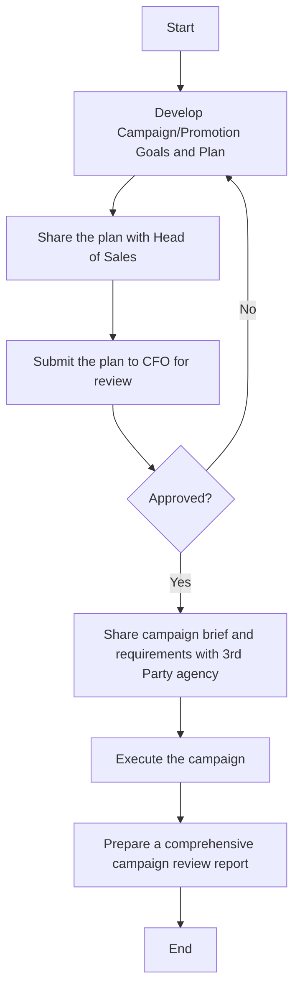

### Analysis of the Flowchart

1. **Process Name**: Advertising and Promotion

2. **Roles (Swimlanes)**:
   - Marketing Manager
   - Head of Marketing
   - CEO

3. **Steps in a Markdown Table**:

| Step # | Role              | Action                                                                                   | Next Step/Logic          |
|--------|-------------------|------------------------------------------------------------------------------------------|--------------------------|
| 1      | Marketing Manager | Develops Campaign/Promotion Goals and Plan, aligned with the annual marketing plan (M)   | Step 2                   |
| 2      | Head of Marketing | Shares the plan with Head of Sales for discussion and alignment on the Campaign (M)      | Step 3                   |
| 3      | Head of Marketing | Submits the plan to CFO for review. After CFO review, it is submitted to CEO for approval (M) | Decision: Approved?  |
| 4      | Marketing Manager | Shares campaign brief and requirements with 3rd Party agency to develop campaign creatives (M) | Step 5 (Yes Decision) |
| 5      | Marketing Manager | Executes the campaign. Documents all communication of the campaign between department (M) | Step 6                   |
| 6      | Marketing Manager | Prepares a comprehensive campaign review report within 30 days after conclusion (M)     | End                      |

4. **Mermaid.js Code Block**:

This structured analysis breaks down the flowchart into its components, mapping out the process as a flow using Mermaid.js, and listing each step in the process with clear logic and relationships.