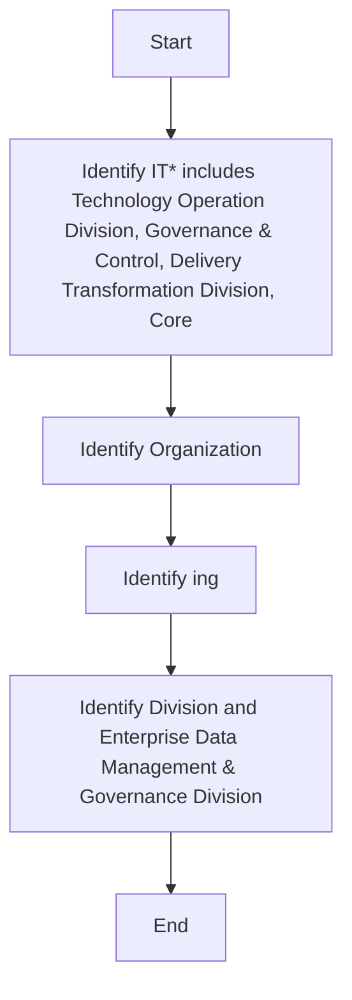

## .4. Open Data KPIs

It is important to measure the progress of the Open Data Plan and gather statistics on identification, prioritization, and publishing of open datasets. Open Data Officer is accountable for adopting the Key Performance Indicators (KPIs). The following table delineates the open data key performance indicators:

| Category | Metric | Description |
| --- | --- | --- |
| Open Data Downloads | Number of downloads per published Open Datasets | Total number of downloads against the published open datasets. |
| Open Data Identification and Prioritization | Number of identified and prioritized Open Datasets | Total number of Open datasets identified in [client] . Metrics on prioritized datasets from the identified open datasets. |
| Open Data Publication | Number of identified Open Datasets that have been published | Total number of identified datasets that have been published annually. |
| Open Data Utilization | Number of updates performed on published Open Datasets. | Total number of updates done on already published open datasets. |


**[Flowchart — Word Shapes]:**

1. IT* includes Technology Operation Division, Governance & Control, Delivery Transformation Division, Core
2. Organization
3. ing
4. Division and Enterprise Data Management & Governance Division


**[Flowchart — Structured]:**

```markdown
### Step Table

| Step | Description                                                                           |
|------|---------------------------------------------------------------------------------------|
| 1    | Identify IT* includes Technology Operation Division, Governance & Control, Delivery Transformation Division, Core |
| 2    | Identify Organization                                                                 |
| 3    | Identify ing                                                                          |
| 4    | Identify Division and Enterprise Data Management & Governance Division                |

### Mermaid Diagram


```