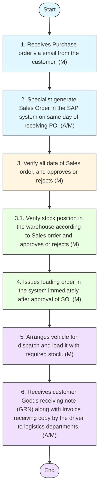

## E-commerce Aggregators Customer Onboarding

##### Policy Statement
 All customers onboarding process shall involve detailed customer profile, category insight on customer platform such as customer insights, category size and competitors’ offerings etc.
 Only approved aggregator platforms with verified legal status and relevant reach in the target market shall be onboarded.
 Evaluation shall be based on platform reputation, user base, alignment with the company's brand, and commercial terms.
 A sales expectation along with annual joint Promotional Plan should be developed to have realistic expectation from the specific platform.
 All SKUs listed shall be pre-approved by the Head of Marketing.
 Any price variation or promotion must receive prior approval from the Head of Marketing and CFO.
 Only official, approved content may be shared with e-commerce partners.
 Updates (e.g., pack change, price change) shall be communicated within 3 working days.
 Marketing shall ensure the timely completion of platform onboarding forms, product sheets, and legal agreements.
 MRP and selling price on aggregator platforms shall match the approved Pricing strategy.
 Inventory allocation shall be coordinated with Sales and Warehouse teams to avoid stockouts or over-commitments.
 Marketing shall monitor pricing integrity across all platforms and address undercutting or unauthorized listings.
 All promotional campaigns (flash sales, bundles, discounts) shall be initiated by the Marketing Department.
 Post-campaign performance reviews shall be conducted to assess ROI and learnings.
 Queries, reviews, or complaints received via e-commerce partners shall be responded to within 24–48 hours.
 Monthly review meetings shall be done to keep track on the progress and any hurdles facing for business growth.
 A summary report shall be submitted to senior management quarterly.
 Action plans shall be developed for underperforming SKUs or platforms.
 Moreover, proper segregation of duties should be specified in the sale order process whereby sales order is generated by E com specialist after receiving Purchase order from customer, Supply chain shall be responsible for stock availability, verification and dispatches, and Finance for credit limits, data accuracy and invoicing.
 Marketing reserves the right to delist products or suspend aggregator partnerships due to breach of contract, pricing policy violations, or reputational risk.
 Any such action must be documented and approved by the Head of Marketing and Legal Advisor.
##### Procedure
The following procedures shall be followed for customer onboarding:

| S No. | Procedure description | Responsibility | Frequency |
| --- | --- | --- | --- |
| 1 | **Customer Share it Proposal:** • The Head of Marketing receive the Company Profile and Proposal from E commerce customer for onboarding. The proposal must accompany or be asked for at least following data: • Comprehensive details about E com website and its operations. • Customer insights and more specifically category relevant. • Category size and growth rate. • Competitors’ products available and their offerings. | • Preparer / Performed By : E com Customer. • Reviewer: Head of Marketing and E commerce Specialist. | Frequency: As required |
| 2 | **Survey Market:** • E commerce specialist will verify all details through its own sources the performance of e commerce vendor, competitors’ rebates, discounts, and targets and share recommendation for the agreement negotiations with Marketing Manager. | **Preparer / Performed By :** • E commerce Specialist. • Reviewer: Marketing Manager • Approver: Head of Marketing | Frequency: As required |
| 3 | **Negotiation with Customer** • Marketing Manager along with E commerce specialist negotiate proposal with vendor as per given approval from Head of Marketing. Customers submit draft agreement. The agreement should contain Sales expectations. | Preparer / Performed By : Marketing Manager and E commerce Specialist. | Frequency: As required |
| 4 | **Review of Draft Agreement by Sales** • Marketing Manager email draft agreement to Director B2C Sales and Head of Sales for their review and approval. | **Preparer / Performed By : Marketing Manager** • Reviewer: Head of Sales and Director B2C Sales | Frequency: As required |
| 5 | **Review of draft agreement by Finance and Legal** • After Sales approval, Marketing Manager email draft agreement to Head of legal and CFO for review and approval. In case of credit sales, CFO will share credit limit and any further requirement such as promissory note. | **Preparer / Performed By : Marketing Manager** • Reviewer: CFO and Head of Legal | Frequency: As required |
| 6 | **Official Agreement** • After approval from legal and CFO, vendor submit official signed agreement along with required documentations for official agreement. This document should be officially signed by Head of marketing and witnessed by CFO and Legal. | • Prepare: Vendor. • Approver: Head of Marketing, CFO and Legal | Frequency: As required |

##### E-Commerce Customer Sales Order Procedure
The following procedures shall be followed for E-Commerce Customer Sales Order:

| S No. | Procedure description | Responsibility | Frequency |
| --- | --- | --- | --- |
| 1 | **Purchase Order (PO) Received from the Customer :** • The E commerce Specialist receive s Purchase order via email from the cu stomer. | • Preparer / Performed By : E com Customer. • Reviewer: E commerce Specialist. | Frequency: As required |
| 2 | **Generating Sale Order (SO) :** • E commerce specialist generate Sales Order in the SAP system on same day of receiving PO . • Note: • Sales Order can be generated in SAP system even when Stock is not available, or Credit limit is exceeded . | **Preparer / Performed By :** • E commerce Specialist. • Reviewer: Marketing Manager | Frequency: As required |
| 3 | **SAP Credit and Control Check** • SAP automated control to check credit limit of customer and stock availability. In case of credit limit or required stock is not available then sales order is not approved in SAP for further processing until both conditions are satisfied. | Performed by : SAP Automated control check | Frequency: As required |
| 4 | **Supply chain issue Loading Order to Logistics** • Supply chain issues loading order in the system immediately after approval of SO. • Refer logistics manual for details. | **Preparer / Performed By : Refer logistics manual** • Reviewer: E com specialist | Frequency: As required |
| 5 | **Logistics arrange vehicle for dispatch** • Logistics manager arrange s vehicle for dispatch and load it with required stock. The loaded vehicle will be dispatched to weighing bridge . This process should be done within 24 hours of SO approval from the Finance and Supply chain. • Refer logistics manual for details. | **Preparer / Performed By : Logistics Manager** • Reviewer: E com specialist | Frequency: As required |
| 6 | **Stock Delivery and Invoicing** • Vehicle will be weighed at the weighing bridge and invoice will be generated from the system . Invoic e, Purchase Order and Loading Order original and a copy will be handed over to vehicle driver for customer receiving . After receiving of stocks by the customer , customer Goods receiving note (GRN) along with Invoice receiving copy should be submitted by the driver to log istics departments . In case customer does not issues GRN, a receiving on Invoice and Loading order would be suffice d . • Note: • Finance is respons ible for Invoice correctness, issuance or any issue arise in the system at the time of vehicle exit on weighing bridge. All receiving should be submitted to Finance for record keeping purpose. AR account ant is responsible for credit recovery. However, E com specialist will support in coordination and communication. | **Prepare: Logistics Manager** • Approver : Accounting Manager , • Reviewer: • E com Specialist | Frequency: As required |

##### Flow chart

**[Diagram — PNG]:**

**Process Name:** E-Commerce Customer Sales Order Procedure

**Roles / Swimlanes:**
- E Commerce Specialist
- Finance Manager
- Supply Chain Manager
- Logistics Manager

---

### Steps

| Step # | Role                  | Action                                                                                                                   | Decision/Next Step                                                                                          |
|--------|-----------------------|--------------------------------------------------------------------------------------------------------------------------|-------------------------------------------------------------------------------------------------------------|
| Start  | E Commerce Specialist | Start                                                                                                                    | Proceeds to step 1.                                                                                         |
| 1      | E Commerce Specialist | Receives Purchase order via email from the customer. (M)                                                                 | Proceeds to step 2.                                                                                         |
| 2      | E Commerce Specialist | Specialist generate Sales Order in the SAP system on same day of receiving PO. (A/M)                                    | Proceeds to step 3.                                                                                         |
| 3      | Finance Manager       | Verify all data of Sales order, and approves or rejects (M)                                                             | Proceeds downward in the flow to step 3.1. The diagram notes “approves or rejects” but shows no branches.  |
| 3.1    | Supply Chain Manager  | Verify stock position in the warehouse according to Sales order and approves or rejects (M)                             | Proceeds to step 4. The diagram notes “approves or rejects” but shows no branches.                         |
| 4      | Supply Chain Manager  | Issues loading order in the system immediately after approval of SO. (M)                                               | Proceeds to step 5.                                                                                         |
| 5      | Logistics Manager     | Arranges vehicle for dispatch and load it with required stock. (M)                                                      | Proceeds to step 6.                                                                                         |
| 6      | Logistics Manager     | Receives customer Goods receiving note (GRN) along with Invoice receiving copy by the driver to logistics departments. (A/M) | Proceeds to End.                                                                                           |
| End    | Logistics Manager     | End                                                                                                                      | Flow terminates.                                                                                            |

---

