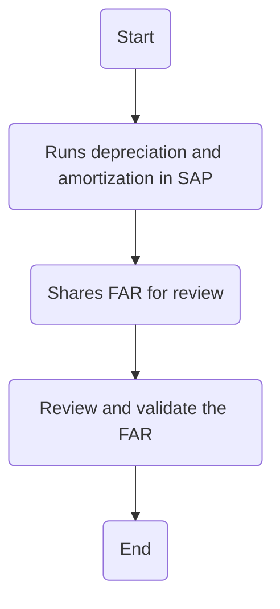

### Flowchart Analysis

1. **Process Name**: Depreciation and Amortization

2. **Roles (Swimlanes)**:
   - FA Manager
   - GL Manager and Accounting Manager

3. **Steps in Markdown Table**:

| Step # | Role                       | Action                                     | Next Step      |
|--------|----------------------------|--------------------------------------------|----------------|
| 1      | FA Manager                 | Start                                      | Step 2         |
| 2      | FA Manager                 | Runs depreciation and amortization in SAP  | Step 3         |
| 3      | FA Manager                 | Shares FAR for review                      | Step 4         |
| 4      | GL Manager and Accounting Manager | Review and validate the FAR            | End            |

4. **Logic as Mermaid.js Code Block**:

