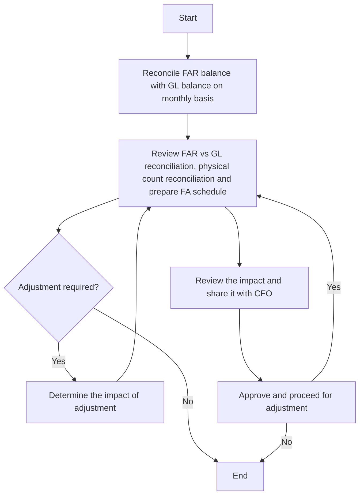

### Analysis

1. **Process Name:** Reconciliation and Adjustments

2. **Roles (Swimlanes):**
   - FA Manager
   - GL Manager
   - Accounting Manager
   - CFO

3. **Steps in Markdown Table:**

| Step # | Role              | Action                                                                                   | Next Step/Logic                   |
|--------|-------------------|------------------------------------------------------------------------------------------|-----------------------------------|
| 1      | FA Manager        | Start                                                                                    | Step 2                            |
| 2      | FA Manager        | Reconcile FAR balance with GL balance on a monthly basis                                 | Step 3                            |
| 3      | GL Manager        | Review FAR vs GL reconciliation, physical count reconciliation and prepare FA schedule   | Step 4                            |
| 4      | GL Manager        | Adjustment required?                                                                     | Yes: Step 5, No: Step 6           |
| 5      | GL Manager        | Determine the impact of adjustment                                                       | Step 4                            |
| 6      | Accounting Manager| Review the impact and share it with CFO                                                  | Step 7                            |
| 7      | CFO               | Approve and proceed for adjustment                                                       | Yes: Step 3, No: End              |
| End    |                   | End                                                                                      |                                   |

4. **Mermaid.js Code Block:**

This structure captures the flow of actions and decisions outlined in the flowchart, providing clear paths for each decision point.