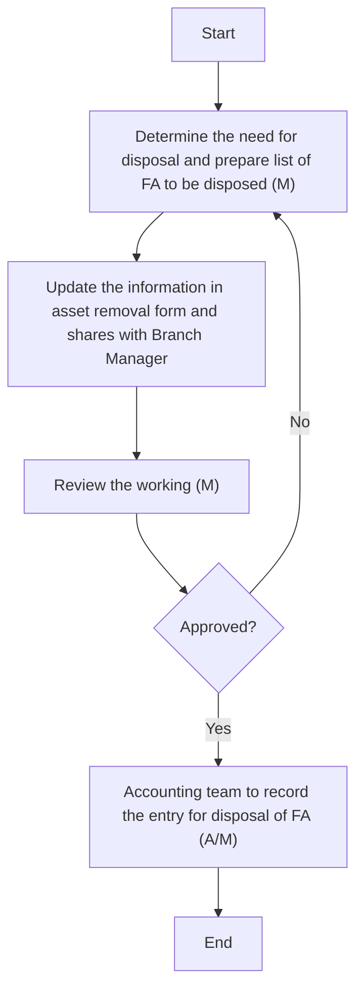

### Analysis of the Flowchart

1. **Process Name**: FA Disposal

2. **Roles (Swimlanes)**:
   - GL Manager
   - Accounting Manager
   - Asset Exclusion Committee
   - Accounting Team

3. **Steps in Markdown Table**:

| Step # | Role                      | Action                                                                         | Next Step/Logic                      |
|--------|---------------------------|--------------------------------------------------------------------------------|--------------------------------------|
| 1      | GL Manager                | Determine the need for disposal and prepare list of FA to be disposed (M)       | Step 2                               |
| 2      | GL Manager                | Update the information in asset removal form and share with Branch Manager      | Step 3                               |
| 3      | Accounting Manager        | Review the working (M)                                                          | Step 4                               |
| 4      | Asset Exclusion Committee | Approved?                                                                       | If Yes: Step 5, If No: Step 1        |
| 5      | Accounting Team           | Accounting team to record the entry for disposal of FA (A/M)                    | End                                  |

4. **Mermaid.js Code Block**:

This setup clearly identifies the roles, actions, and decision paths in the process.