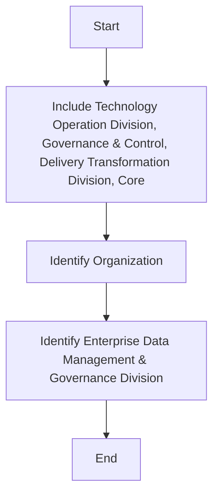

## .3. Roles, Responsibilities and RACI Matrix

The following roles and responsibilities are applicable to this policy:
 Data Management and Governance Leadership Team / Compliance Team: The executive body of  data management & governance is responsible for signing off on any changes, exemption, and exceptions to this policy.
 Data Privacy Officer: An experienced privacy professional plays a key role in Personal Data Protection policy implementation during all phases (planning, processing, security, control, report and respond).
 Data Privacy Compliance Officer: The data privacy compliance office supports during the implementation of all the phases (planning, processing, security, control, report and respond) of Personal Data Protection policy. Data privacy compliance officer is accountable for monitoring compliance of the policy.
 CISD: CISD team is accountable and responsible for all the security related activities from conducting information security risk assessment till notification of personal data breach of the policy. Also consulted during the other activities of the policy.
 Legal: Legal team is consulted for all phases (planning, processing, security, control, report and respond) during the implementation of PDP policy.
 Data Owner: Data Owner is consulted during the planning of the implementation. Data Owner is majorly responsible for managing all the data requests during the processing and respond to data requests.
 Privacy Champion: Privacy Champion is responsible and accountable for the major activities during the implementation of all the phases (planning, processing, security, control, report and respond) of Personal Data Protection policy in their respective unit or department.
 IT: IT team is accountable for managing all the data requests during the processing and is responsible for conducting data protection impact and information security risk assessment, Implementation of technical and al measures for ensuring the security of the processing, information security incident management.

| Main Activities | The Board | DP Leadership Team/ Compliance Committee | Data Privacy Officer | Data Privacy Compliance Officer | CISD | Legal | Data Owner | Privacy Champion | IT* |
| --- | --- | --- | --- | --- | --- | --- | --- | --- | --- |
| Planning |  |  |  |  |  |  |  |  |  |
| Regular review and update of the list of PDPL requirements |  | I | A, R | S | I | C | I |  |  |
| Develop Review Data Privacy Policy and Plan |  | C | A | S | I | C | I | R | I |
| Define the legal basis, purposes, list of personal data for processing and records the retention period |  | I | R | I | R | C | A | I |  |
| Prepare templates (Consents, Notices, DPIA Reports, Requests and Responds) |  | I | A, R | S | C | I |  |  |  |
| Conduct data protection impact assessments (DPIA) |  | I | R | I | C | A | R |  |  |
| Review & Update Data Processor, Third Party processing agreements |  | I | A, R | S | I | C | I |  |  |
| Prepare and conduct data protection awareness training |  | I | R | S | I | C | I | A | I |
| Processing |  |  |  |  |  |  |  |  |  |
| Collect consents from the data subjects |  | R | I | C | A, R | I |  |  |  |
| Notify the data subjects about the processing |  | I | R | I | C | A, R | I |  |  |
| Rectification of inaccurate data on request |  | I | C, I |  | R | A |  |  |  |
| Erase/ Restrict processing on request |  | C, I | C |  | R | A |  |  |  |
| Preparing data for porting on request |  | C, I | C |  | R | A |  |  |  |
| Consultation of the data subjects |  | A, R | I | C | R |  |  |  |  |
| Regularly update Records of processing activities |  | I | R | C |  | C | R | A |  |
| Security |  |  |  |  |  |  |  |  |  |
| Conduct information security risk assessment |  | I | A, R |  | I | R |  |  |  |
| Review Information Security Policy |  | A | C | I | R | C | I |  |  |
| Implement technical and organization al measures for ensuring the security of the processing |  | I | C, I | I | A, R |  | I | R |  |
| Information Security incident management |  | I | C, I | I | A, R |  | I | R |  |
| Notification of personal data breach |  | I | A | S | R | C | R | I |  |
| Control, Report and Respond |  |  |  |  |  |  |  |  |  |
| Report to the Senior management level |  | I | A | S | C | R | I |  |  |
| Communicate and cooperate with the supervisory authority |  | I | A, R | S | C | R | I |  |  |
| Monitor compliance |  | I | R | A | C | R | I |  |  |
| Respond to requests from the Data Subjects |  | I | A | S | C | R | C |  |  |


**[Flowchart — Word Shapes]:**

1. IT* includes Technology Operation Division, Governance & Control, Delivery Transformation Division, Core
2. Organization
3. ing Division and Enterprise Data Management & Governance Division


**[Flowchart — Structured]:**

```markdown
### Step Table

| Step | Description                                                                 |
|------|-----------------------------------------------------------------------------|
| 1    | Include Technology Operation Division, Governance & Control, Delivery Transformation Division, Core |
| 2    | Identify Organization                                                       |
| 3    | Identify Enterprise Data Management & Governance Division                   |

### Mermaid Diagram


```