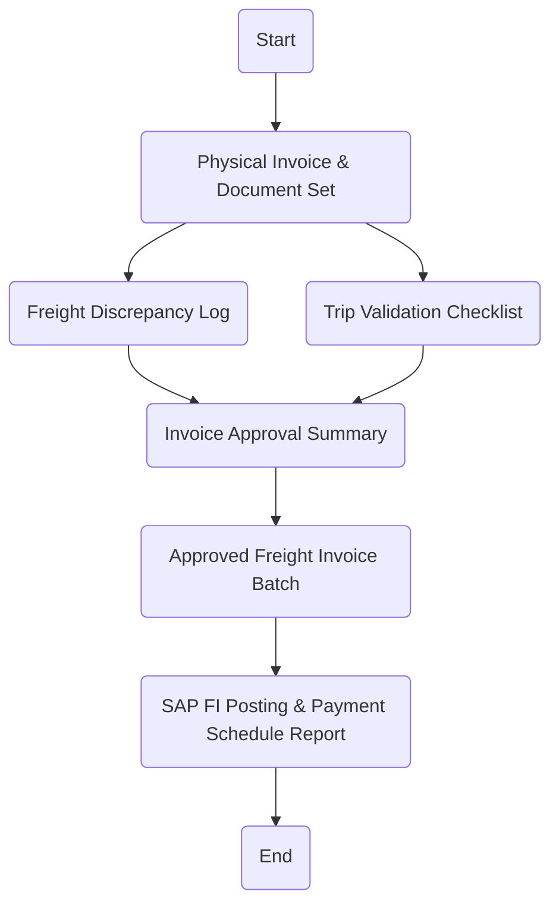

# Policies & Procedure for Freight Invoice Process

This section outlines the policies that govern the validation, submission, and approval of freight invoices at Arabian Mills. Ensuring accuracy in freight billing, transporter compliance, and system-based verification is critical to avoid overpayments, duplicate invoices, and unapproved charges within the logistics function.
Policies
Freight Invoice Submission Window:
 Transporters must submit their freight invoices within 10 working days of trip completion, along with mandatory supporting documents.
Mandatory Supporting Documents:
 Each freight invoice must be accompanied by a signed delivery note, weighbridge slip (if applicable), gate pass, and approved trip sheet.
SAP System Validation:
 Freight invoices shall be verified against SAP freight agreements (condition records), trip data, and vehicle assignment to ensure rate and route consistency.
Invoice Review and Discrepancy Handling:
 Any discrepancies in invoice amount, route, or vehicle usage must be escalated to the Transport Supervisor and resolved before submission to Finance.
Authorization Workflow:
 No freight invoice shall be processed without approval from the Logistics Manager and verification by the Transport Analyst.
Duplicate Invoice Prevention:
 Each invoice number must be logged in the SAP vendor ledger to block duplicate payment processing. Manual checks shall also be performed monthly.
Transporter Compliance Monitoring:
 Transporters submitting frequent inaccurate or unsupported invoices may be flagged for audit and potential suspension.
Procedure

| S. No. | Responsibility | Procedure Description | Output / Report |
| --- | --- | --- | --- |
| 1 | Transporter | Submit freight invoice with all supporting documents (DN, weighbridge slip, gate pass, trip sheet) as per the contractual arrangement . | Physical Invoice & Document Set |
| 2 | Dispatch Supervisor | Cross-check invoice with trip completion data and validate supporting documents for accuracy and trip number match. | Trip Validation Checklist |
| 3 | Transport Analyst | Verify rate, route, and vehicle in SAP against freight agreement. Flag discrepancies to Transport Supervisor. | Freight Discrepancy Log |
| 4 | Transport Supervisor | Review flagged issues, resolve with transporter, and approve final invoice for SAP posting. | Invoice Approval Summary |
| 5 | Logistics Manager | Review and authorize final batch of invoices; escalate any audit concerns or policy breaches. | Approved Freight Invoice Batch |
| 6 | Finance Coordinator | Post verified invoice to SAP, initiate payment as per payment terms, and block duplicate invoice number in vendor ledger. | SAP FI Posting & Payment Schedule Report |

Flowchart

**[Diagram — PNG]:**

**Freight Invoice Process**

**Roles / Swimlanes:**
- Transportation
- Dispatch Supervisor
- Logistics Manager
- Finance Coordinator

| Step # | Role                | Action                                     | Decision/Next Step                   |
|--------|---------------------|--------------------------------------------|--------------------------------------|
| 1      | Transportation      | Start                                      | Physical Invoice & Document Set      |
| 2      | Transportation      | Physical Invoice & Document Set            | Freight Discrepancy Log              |
| 3      | Dispatch Supervisor | Freight Discrepancy Log                    | Invoice Approval Summary             |
| 4      | Dispatch Supervisor | Trip Validation Checklist                  | Invoice Approval Summary             |
| 5      | Logistics Manager   | Invoice Approval Summary                   | Approved Freight Invoice Batch       |
| 6      | Finance Coordinator | Approved Freight Invoice Batch             | SAP FI Posting & Payment Schedule Report |
| 7      | Finance Coordinator | SAP FI Posting & Payment Schedule Report   | End                                  |

