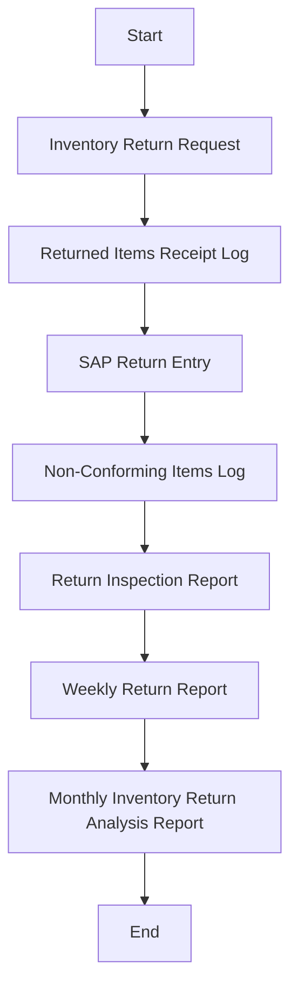
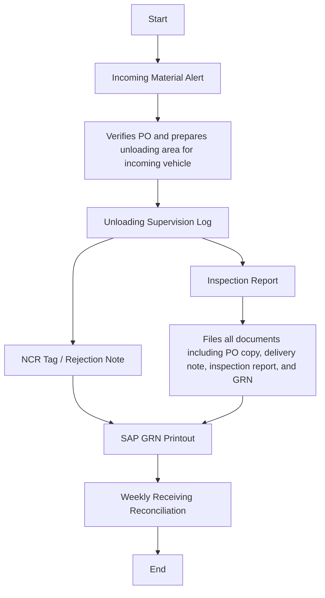

# Policies & Procedure for Inventory Returns (internal & inbound)

Policies (Internal)
This section describes the policies for returning unused, excess, or rejected inventory items from internal departments back to the warehouse at Arabian Mills. All returns must be properly verified, documented, and posted in SAP to ensure inventory accuracy and traceability.
 Return Authorization
Inventory returns must be initiated by the department that received the goods and must be authorized by the respective Department Head.
 Condition Assessment Before Re-Stocking
Returned items must be inspected by the Store and Quality teams to confirm that the items are in acceptable condition for re-stocking.
 Separate Handling of Rejected / Expired Items
Any items found expired, damaged, or rejected must be segregated and clearly labelled as “Hold” or “Scrap.” Such items must not be reissued unless revalidated.
 System-Based Return Entry
All approved returns must be recorded in SAP against the original issuance or return reference.
 Root Cause Documentation for Excess Returns
In case of large or repeated returns, the concerned department must provide justification for analysis and corrective actions.
Procedure (Internal)

| S. No. | Responsibility | Procedure Description | Output / Report |
| --- | --- | --- | --- |
| 1 | Department User | Prepares return note or system-based return request with item details, reason for return, and quantity | Inventory Return Request |
| 2 | DC Officer | Receives returned items, checks physical condition, and tags for inspection | Returned Items Receipt Log |
| 3 | Quality Inspector | Inspects batch number, packaging, and expiry where applicable; approves or rejects for re-stocking | Return Inspection Report |
| 4 | DC Officer | Accepts approved items back into inventory and updates SAP return entry with reference to original MRS | SAP Return Entry |
| 5 | DC Officer | Segregates and documents items not suitable for re-stocking (e.g., expired, damaged) | Non-Conforming Items Log |
| 6 | Warehouse Section Head | Reviews weekly return trends and coordinates with departments for justification and corrective actions | Weekly Return Report |
| 7 | Inventory Controller | Analysis monthly return volume and reasons, reports chronic issues to management | Monthly Inventory Return Analysis Report |

Flowchart (Internal)

**[Diagram — PNG]:**

**Process Name:** Inventory Returns (internal)

**Roles / Swimlanes:**
- Department User
- DC Officer
- Quality Inspector
- Warehouse Section Head
- Inventory Controller

| Step # | Role                    | Action                                   | Decision/Next Step                       |
|--------|-------------------------|------------------------------------------|------------------------------------------|
| 1      | Department User         | Start                                    | Inventory Return Request                 |
| 2      | Department User         | Inventory Return Request                 | Returned Items Receipt Log               |
| 3      | DC Officer              | Returned Items Receipt Log               | SAP Return Entry                         |
| 4      | DC Officer              | SAP Return Entry                         | Non-Conforming Items Log                 |
| 5      | DC Officer              | Non-Conforming Items Log                 | Return Inspection Report                 |
| 6      | Quality Inspector       | Return Inspection Report                 | Weekly Return Report                     |
| 7      | Warehouse Section Head  | Weekly Return Report                     | Monthly Inventory Return Analysis Report |
| 8      | Inventory Controller    | Monthly Inventory Return Analysis Report | End                                      |

Policies (Inbound)
This section outlines the inventory policies related to the receipt of raw materials, packaging materials, spare parts, consumables, and other stock items at Arabian Mills. Proper receiving procedures are critical to ensure accurate quantity intake, quality conformance, system traceability, and safe handling before inventory is accepted into stock. All receipts must be supported by formal documentation and SAP entries.
 Authorized Receiving Only
All inbound inventory must be received only by authorized store personnel against a valid Purchase Order (PO) or inter-departmental transfer note.
 Goods Receipt Note (GRN)
A Goods Receipt Note (GRN) must be created in SAP immediately upon physical receipt of goods after inspection and verification.
 Inspection Before Acceptance
All received materials must be inspected for quantity, quality, packaging condition, batch number (if applicable), and expiry date before acceptance into inventory.
 Segregation of Damaged Goods
Any damaged, expired, or incorrect items must be physically segregated, labelled, and reported immediately for further action.
 Batch and Expiry Capture
Where applicable, batch numbers and expiry dates must be recorded in SAP and on physical tags.
 Weighbridge/Measurement Confirmation
For bulk or weight-sensitive materials, quantity confirmation through weighbridge or calibrated scales is mandatory.
 Documentation Retention
All delivery challans, inspection reports, and GRNs must be retained for audit and reconciliation purposes.
Procedure (Inbound)

| S. No. | Responsibility | Procedure Description | Output / Report |
| --- | --- | --- | --- |
| 1 | Warehouse Section Head | Receives advance intimation of incoming material from Procurement or Production team | Incoming Material Alert |
| 2 | DC Officer | Verifies PO and prepares unloading area for incoming vehicle | PO Verification Record |
| 3 | DC Officer | Supervises unloading and performs initial physical count and visual inspection | Unloading Supervision Log |
| 4 | Quality Inspector | Conducts quality inspection based on predefined parameters (sample, batch, expiry, packaging) | Inspection Report |
| 5 | DC Officer | Segregates non-conforming items (if any) and informs concerned departments | NCR Tag / Rejection Note |
| 6 | DC Officer | Enters accepted quantity into SAP and generates GRN | SAP GRN Printout |
| 7 | Warehouse Section Head | Files all documents including PO copy, delivery note, inspection report, and GRN | Receiving Documentation File |
| 8 | Inventory Controller | Verifies system entry against physical receipt weekly and reports anomalies | Weekly Receiving Reconciliation |

Flowchart (Inbound)

**[Diagram — PNG]:**

**Process Name:** Inventory Returns (Inbound)

**Roles / Swimlanes:**
- Warehouse Section Head
- DC Officer
- Quality Inspector
- Inventory Controller

**Markdown Table:**

| Step # | Role                    | Action                                                           | Decision/Next Step                     |
|--------|-------------------------|------------------------------------------------------------------|----------------------------------------|
| 1      | Warehouse Section Head  | Incoming Material Alert                                          | Step 2                                 |
| 2      | DC Officer              | Verifies PO and prepares unloading area for incoming vehicle    | Step 3                                 |
| 3      | DC Officer              | Unloading Supervision Log                                        | Step 4                                 |
| 4      | DC Officer              | NCR Tag / Rejection Note                                         | Step 5                                 |
| 5      | DC Officer              | SAP GRN Printout                                                 | Step 8                                 |
| 6      | Quality Inspector       | Inspection Report                                                | Step 7                                 |
| 7      | DC Officer              | Files all documents including PO copy, delivery note, inspection report, and GRN | Step 8                    |
| 8      | Inventory Controller    | Weekly Receiving Reconciliation                                 | End                                    |
| 9      | Inventory Controller    | End                                                              | -                                      |

**Mermaid.js Code Block:**

