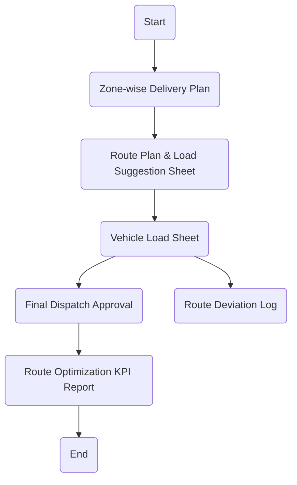

# Policies & Procedure for Route & Load Optimization

This section defines the policies governing route planning and vehicle load optimization at Arabian Mills. These policies ensure that all distribution trips are executed efficiently, with full utilization of vehicle capacity, minimized logistics costs, and adherence to system-defined delivery routes.
Policies
System-Based Route Assignment:
 All shipments must be routed using excel sheet, Route Master or system-generated routing logic based on customer zone and delivery priority.
Load Consolidation Requirement:
 Multiple orders destined for the same region must be consolidated into a single trip where possible, considering product compatibility and delivery deadlines.
Vehicle Capacity Utilization:
 Trucks should be loaded to at least 70% of their defined weight or volume capacity. Any underutilized dispatch must be approved by the Logistics Manager with written justification.
Dispatch Approval Protocol:
 Each route and load plan must be reviewed and approved by the Transport Supervisor prior to vehicle release.
Route Deviation Control:
 In case of unavoidable diversions, the driver must record the route deviation and communicate it to the Dispatch Supervisor for logging and review.
Priority Load Handling:
 Orders for key accounts or urgent deliveries must be flagged and routed separately to avoid delays caused by load consolidation logic.
Route Review Cycle:
 Route performance, cost-per-ton, and vehicle fill rates must be analyzed weekly by the Transport Analyst and shared with the Logistics Manager for continuous improvement.
Procedure

| S. No. | Responsibility | Procedure Description | Output / Report |
| --- | --- | --- | --- |
| 1 | Transport Planner | Retrieve daily delivery plan and group orders based on delivery zones, customer category, and shipment timing. | Zone-wise Delivery Plan |
| 2 | Logistics User | Run optimization scenario use approved load-planning spreadsheet. | Route Plan & Load Suggestion Sheet |
| 3 | Dispatch Supervisor | Validate proposed load vs. vehicle capacity and flag underutilized or excess weight conditions. | Vehicle Load Sheet |
| 4 | Transport Supervisor | Approve final route and load assignment, ensuring vehicle and driver availability. | Final Dispatch Approval |
| 5 | Driver / Gate Clerk | Follow planned route unless emergency deviation is logged in the route deviation register. | Route Deviation Log |
| 6 | Transport Analyst | Analyze weekly route performance and loading KPIs; prepare report for Logistics Manager review. | Route Optimization KPI Report |

Flowchart

**[Diagram — PNG]:**

**Process Name: Route and Load Optimization**

**Roles / Swimlanes:**
- Transportation
- SAP Logistics User
- Dispatch Supervisor
- Driver / Gate Clerk

**Markdown Table:**

| Step # | Role                  | Action                          | Decision/Next Step               |
|--------|-----------------------|---------------------------------|----------------------------------|
| 1      | Transportation        | Start                           | Zone-wise Delivery Plan          |
| 2      | Transportation        | Zone-wise Delivery Plan         | Route Plan & Load Suggestion Sheet |
| 3      | SAP Logistics User    | Route Plan & Load Suggestion Sheet | Vehicle Load Sheet               |
| 4      | Dispatch Supervisor   | Vehicle Load Sheet              | Final Dispatch Approval          |
| 5      | Transportation        | Final Dispatch Approval         | Route Optimization KPI Report    |
| 6      | Transportation        | Route Optimization KPI Report   | End                              |
| 7      | Driver / Gate Clerk   | Route Deviation Log             |                                  |

**Mermaid.js Code Block:**

