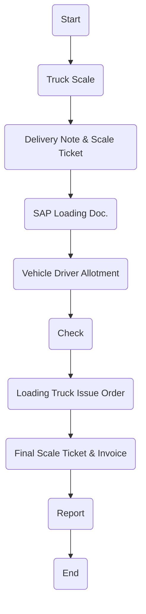

# Policies for Finished Goods Logistics - Animal Bran

This section presents the official logistics policies for Finished Goods Animal Bran at Arabian Mills. Given the nature of this product, adherence to strict hygiene, documentation, and process discipline is essential to ensure safety, quality, and regulatory compliance throughout the distribution process.
Policies
Logistics Requisition:
 Animal Bran logistics will be initiated based on an approved requisition from the Arabian Mills. Logistics Department.
Product Quality Verification:
 All Animal Bran shipments must pass quality inspection checks to confirm product safety, batch conformity, and packaging integrity prior to loading.
Truck Hygiene Treatment:
 Trucks assigned for logistics must undergo full chemical cleaning to eliminate any source of contamination.
 Sanitization records must be verified by the QA team before vehicle entry to loading zone.
Driver Safety & Hygiene Compliance:
 Drivers must wear complete PPE (personal protective equipment) before entering the Loading Area.
 Driver access is restricted until safety and hygiene compliance is verified.
Contamination Control:
 No Animal Bran shipment shall be dispatched in a vehicle previously used for non-compatible materials unless certified clean.
 Vehicles must be fully dry, odor-free, and visually clean prior to loading.
Procedure
This procedure outlines all steps required for the organized, hygienic, and traceable logistics of Finished Goods Animal Bran from Arabian Mills facility to the end customer.

| No. | Responsibility | Procedure Description | Output/Report |
| --- | --- | --- | --- |
| 1 | Sales Coordinator | Send requisition to Logistics and Warehouse Section . ( Requisition should be before 24 hours from loading) | E-Mail |
| 2 | Sales Coordinator | Issue loading order receipt based on ready product as Sales Stock. | Delivery Note |
| 3 | Logistics Manager | Plan and schedule transport order to logistics transporter for delivery as per pallets stage for customer with Q.C norms. | Schedule Rotation |
| 4 | Logistics Coordinator | Make a record entry into the logistic spreadsheet log . | Log Sheet |
| 5 | Logistics Coordinator | Make the vehicles & drivers allotment. | Delivery Schedule |
| 6 | Logistics Coordinator | Inform the Transporter Department. | E-Mail |
| 7 | Truck Washing | Vehicle should get washed & hygienically cleaned. | Washing Station |
| 8 | Quality Assurance | Verify that the truck has been hygienically washed before departing. | Inspection Form |
| 9 | Driver | Arrive with the vehicle to Main Gate for Weigh Scale. | Security Check |
| 10 | Gate Security | Perform Driver Documents and Vehicle inspection. | Document Inspection |
| 11 | Weigh Scale | Entry pass with weigh-in for Empty Truck (1st Weight). After loading, record Gross weight and calculate Net Weight for invoicing (only for bulk material) . | Weigh Ticket & Invoice |
| 11.0 | **Warehouse** • ( Labors ) | To Give Priority of loading company trucks (or Rental trucks ) to Minimize waiting time . (refer section N truck appointment system below) |  |
| 12 | Driver | Park the vehicle at loading bay. | Loading Bay |
| 13 | Driver | Collect all delivery documents to accompany the shipment. | Invoice / Delivery Note |
| 14 | Driver | Perform loading process under supervision. | Product Loading |
| 15 | Driver & Labors | Offload the products at customer site. | — |
| 16 | Driver | Submit delivery documents to Storekeeper and Quality Assurance. | Delivery Note |
| 17 | Driver | Report back to Logistics Department post-delivery. | — |
| 18 | Quality Assurance | Conduct final inspection and acknowledge offloading completion. | Delivery Note |
| 19 | Logistics Manager | Review delivery compliance and finalize reporting. | — |

Flowchart

**[Diagram — PNG]:**

**Process Name: Finished Goods Transportation - Animal Bran**

**Roles / Swimlanes:**
- Sales
- Weigh-in Scale
- Transportation
- Truck Driver
- FG Warehouse

| Step # | Role           | Action                       | Decision/Next Step            |
|--------|----------------|------------------------------|-------------------------------|
| 1      | Sales          | Start                        | Truck Scale                   |
| 2      | Weigh-in Scale | Truck Scale                  | Delivery Note & Scale Ticket  |
| 3      | Weigh-in Scale | Delivery Note & Scale Ticket | SAP Loading Doc.              |
| 4      | Weigh-in Scale | SAP Loading Doc.             | Vehicle Driver Allotment      |
| 5      | Transportation | Vehicle Driver Allotment     | Check                         |
| 6      | Truck Driver   | Check                        | Loading Truck Issue Order     |
| 7      | FG Warehouse   | Loading Truck Issue Order    | Final Scale Ticket & Invoice  |
| 8      | Weigh-in Scale | Final Scale Ticket & Invoice | Report                        |
| 9      | Weigh-in Scale | Report                       | End                           |

