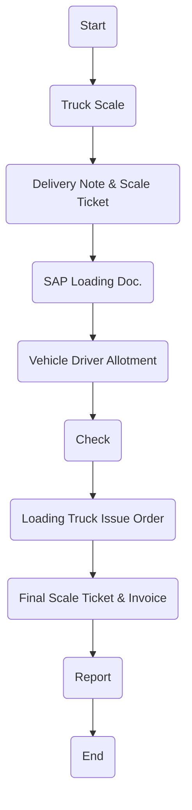

# Policies for Finished Goods Logistics - Animal Feed

This section outlines the policies governing the logistics of Finished Goods Animal Feed at Arabian Mills. Given the sensitivity of animal feed products to contamination and moisture, adherence to strict hygiene and vehicle preparation standards is mandatory to ensure safe delivery.
Policies
Logistics Authorization:
 Animal Feed logistics will be initiated only upon receiving a validated logistics request from the Arabian Mills. Logistics Department.
Product Condition Assurance:
 Quality Control must inspect all finished Animal Feed goods before dispatch to confirm cleanliness, correct labelling, packaging integrity, and compliance with defined standards.
Vehicle Preparation:
 Trucks must be chemically washed and dried before being approved for Animal Feed loading.
 No vehicle shall be used unless certified “fit for feed transport” by the Quality Assurance department.
Driver Hygiene Protocols:
 All drivers must follow hygiene protocols including mandatory PPE (gloves, cap, boots) when entering the loading zone.
 Drivers must not handle feed directly without authorization or sanitization.
Contamination Risk Prevention:
 Any truck that previously transported perishable, hazardous, or non-feed materials must pass a strict decontamination process before use.
 Mixing of different animal feed types in one shipment is prohibited unless authorized and segregated.
Procedure
This section defines the standardized procedure to execute safe and compliant logistics of Animal Feed from Arabian Mills facilities to distribution points or customers. The sequence ensures coordination between Sales, Logistics, Quality, and Warehouse functions.

| No. | Responsibility | Procedure Description | Output/Report |
| --- | --- | --- | --- |
| 1 | Sales Coordinator | Send requisition to Logistics and Warehouse Section. | E-Mail |
| 2 | Sales Coordinator | Issue loading order receipt based on ready product as Sales Stock. | Delivery Note |
| 3 | Logistics Manager | Plan and schedule transport order to logistics transporter for delivery as per pallets stage for customer with Q.C norms. | Schedule Rotation |
| 4 | Logistics Coordinator | Make a record entry into the logistic spreadsheet log . | Log Sheet |
| 5 | Logistics Coordinator | Make the vehicles & drivers allotment. | Delivery Schedule |
| 6 | Logistics Coordinator | Inform the Transporter Department. | E-Mail |
| 7 | Truck Washing | Vehicle should get washed & hygienically cleaned. | Washing Station |
| 8 | Quality Assurance | Verify that the truck has been hygienically washed before departing. | Inspection Form |
| 9 | Driver | Arrive with the vehicle to Main Gate for Weigh Scale . | Security Check |
| 10 | Gate Security | Perform Driver Documents and Vehicle inspection. | Document Inspection |
| 11 | Weigh Scale | Entry pass with weigh-in for Empty Truck (1st Weight). After loading, record Gross weight and calculate Net Weight for invoicing (only for bulk material) . | Weigh Ticket & Invoice |
| 12 | Driver | Park the vehicle at loading bay. | Loading Bay |
| 13 | Driver | Collect all delivery documents to accompany the shipment. | Invoice / Delivery Note |
| 14 | Driver | Perform loading process under supervision. | Product Loading |
| 15 | Driver & Labors | Offload the products at customer site. | — |
| 16 | Driver | Submit delivery documents to Storekeeper and Quality Assurance. | Delivery Note |
| 17 | Driver | Report back to Logistics Department post-delivery. | — |
| 18 | Quality Assurance | Conduct final inspection and acknowledge offloading completion. | Delivery Note |
| 19 | Logistics Manager | Review delivery compliance and finalize reporting. | — |

Flowchart

**[Diagram — PNG]:**

**Process Name: Finished Goods Transportation - Animal Feed**

**Roles / Swimlanes:**
- Sales
- Weigh-in Scale
- Transportation
- Truck Driver
- FG Warehouse

| Step # | Role          | Action                        | Decision/Next Step         |
|--------|---------------|-------------------------------|----------------------------|
| 1      | Sales         | Start                         | Proceed to Truck Scale     |
| 2      | Weigh-in Scale| Truck Scale                   | Proceed to Delivery Note & Scale Ticket |
| 3      | Weigh-in Scale| Delivery Note & Scale Ticket  | Proceed to SAP Loading Doc.|
| 4      | Weigh-in Scale| SAP Loading Doc.              | Proceed to Vehicle Driver Allotment |
| 5      | Transportation| Vehicle Driver Allotment      | Proceed to Check           |
| 6      | Truck Driver  | Check                         | Proceed to Loading Truck Issue Order |
| 7      | FG Warehouse  | Loading Truck Issue Order     | Proceed to Final Scale Ticket & Invoice|
| 8      | Weigh-in Scale| Final Scale Ticket & Invoice  | Proceed to Report          |
| 9      | Weigh-in Scale| Report                        | End                        |

