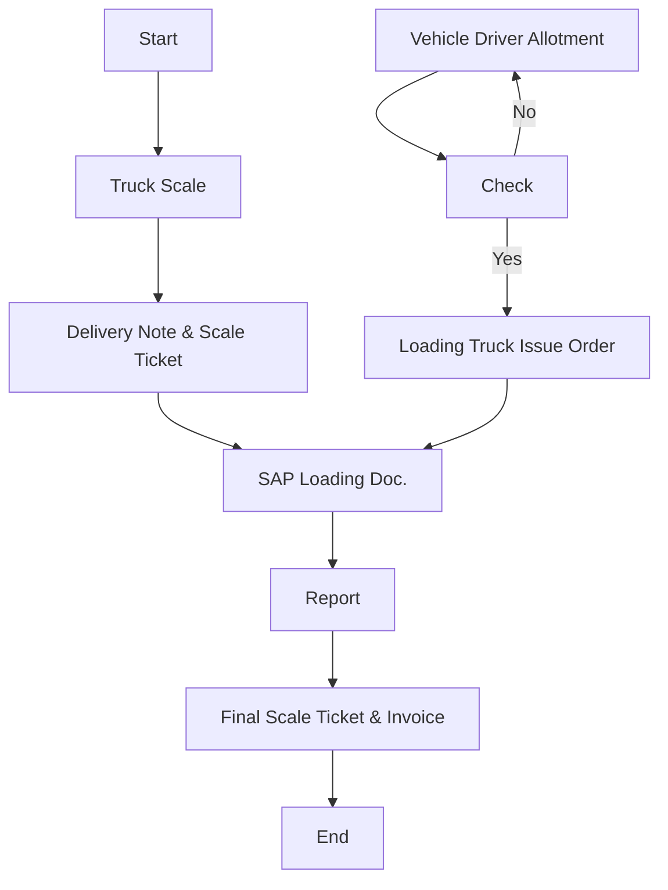

# Policies for Finished Goods Logistics - Flour

This section outlines the logistics policies specific to Finished Goods Flour at Arabian Mills. These policies ensure safe, hygienic, and compliant movement of flour products, preserving product integrity throughout the delivery process. All personnel involved must strictly follow these policies to maintain the company’s commitment to food safety, customer satisfaction, and regulatory compliance.
Policies
Logistics Initiation:
 Finished Goods Flour logistics will be initiated only after receiving an official requisition from the Arabian Mills. Logistics Department.
Product Quality Verification:
 All Finished Goods Flour shipments will undergo quality verification to ensure product integrity, compliance with quality control standards, and absence of contamination prior to dispatch.
Truck Washing & Sanitation:
 All vehicles assigned for flour logistics will undergo mandatory hygienic washing and sanitization prior to loading.
 Washing will eliminate any residue or potential cross-contamination from previous loads.
Driver Hygiene & PPE Compliance:
 All drivers must wear designated personal protective equipment (PPE) when entering the Loading Area.
 Drivers must fully comply with hygiene and safety protocols established by Arabian Mills.
Cross-Contamination Prevention:
 Strict controls will be applied to prevent any cross-contamination during logistics.
 Vehicles used must not carry incompatible or hazardous materials in previous loads unless fully decontaminated.
Procedure
The following procedure defines the detailed step-by-step activities for the safe and compliant logistics of Finished Goods Flour from Arabian Mills. facilities to customer delivery points. Each assigned role is responsible for ensuring timely execution of their assigned tasks.

| No. | Responsibility | Procedure Description | Output/Report |
| --- | --- | --- | --- |
| 1 | Sales Coordinator | Send requisition to Logistics and Warehouse Section. & Warehouses confirm the availability of Product. | E-Mail |
| 2 | Sales Coordinator | Issue loading order receipt based on ready product as Sales Stock. | Delivery Note |
| 3 | Logistics Manager | Plan and schedule transport order to logistics transporter for delivery as per pallets stage for customer with Q.C norms. | Schedule Rotation |
| 4 | Logistics Coordinator | Make a record entry into the excel Sheet . | Log Sheet |
| 5 | Logistics Coordinator | Make the vehicles & drivers allotment. | Delivery Schedule |
| 6 | Logistics Coordinator | Inform the Transporter Department. | E-Mail |
| 7 | Truck Washing | Vehicle should get washed & hygienically cleaned. | Washing Station |
| 8 | Quality Assurance | Verify that the truck has been hygienically washed before departing. | Inspection Form |
| 9 | Driver | Arrive with the vehicle to Main Gate for Weigh Scale. | Security Check |
| 10 | Gate Security | Perform Driver Documents and Vehicle inspection. | Document Inspection |
| 11 | Weigh Scale | Issue entry pass with weigh-in for Empty Truck (1st Weight). After loading, record Gross weight and calculate Net Weight for invoicing (only for bulk material) . | Weigh Ticket & Invoice |
| 12 | Driver | Park the vehicle at loading bay. | Loading Bay |
| 12.0 | Warehouse (Labors) | To Give Priority of loading company trucks ( or Rental trucks ) to Minimize waiting time (refer section N truck appointment system below) | --- |
| 12.1 | Warehouse | Vehicle seal tagging and control for security and hygiene integrity. |  |
| 13 | Driver | Collect all delivery documents to accompany the shipment. | Invoice / Delivery Note |
| 14 | Driver | Perform loading process under supervision. | Product Loading |
| 15 | Driver & Labors | Offload the products at customer site. & return empty pallets. | — |
| 16 | Driver | Submit delivery documents to Storekeeper and Quality Assurance. | Delivery Note |
| 17 | Driver | Report back to Logistics Department post-delivery. | — |
| 18 | Quality Assurance | Conduct final inspection and acknowledge offloading completion. | Delivery Note |
| 19 | Logistics Manager | Review delivery compliance and finalize reporting. | — |

Flowchart

**[Diagram — PNG]:**

**Process Name:** Finished Goods Transportation - Flour

**Roles/Swimlanes:**
- Sales
- Weigh-in Scale
- Transportation
- Truck Driver
- FG Warehouse

| Step # | Role            | Action                          | Decision/Next Step                      |
|--------|-----------------|---------------------------------|-----------------------------------------|
| 1      | Sales           | Start                           | Go to Truck Scale                       |
| 2      | Weigh-in Scale  | Truck Scale                     | Go to Delivery Note & Scale Ticket      |
| 3      | Weigh-in Scale  | Delivery Note & Scale Ticket    | Go to SAP Loading Doc.                  |
| 4      | Weigh-in Scale  | SAP Loading Doc.                | Go to Report                            |
| 5      | Weigh-in Scale  | Report                          | Go to Final Scale Ticket & Invoice      |
| 6      | Weigh-in Scale  | Final Scale Ticket & Invoice    | End                                     |
| 7      | Transportation  | Vehicle Driver Allotment        | Go to Check                             |
| 8      | Truck Driver    | Check                           | Yes: Go to Loading Truck Issue Order    |
|        |                 |                                 | No: Go to Vehicle Driver Allotment      |
| 9      | FG Warehouse    | Loading Truck Issue Order       | Go to SAP Loading Doc.                  |

