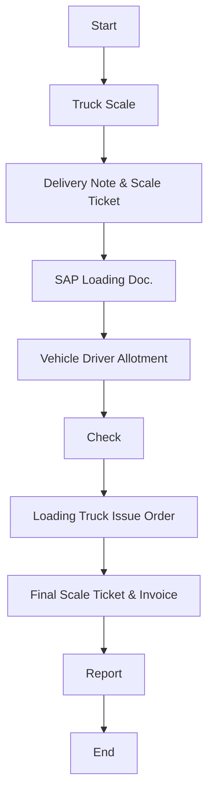

# Policies for Finished Goods Logistics to Key Accounts & Distributors

This section defines the policies for transporting Finished Goods to Key Accounts and Distributors at Arabian Mills. These clients typically place large-volume and recurring orders, requiring well-coordinated scheduling, product integrity, and documentation accuracy to maintain service excellence.
Policies
Logistics Trigger:
 Logistics for Key Accounts and Distributors will be initiated based on validated need and confirmed orders from the Sales Department.
Vehicle Cleanliness & Suitability:
 All trucks must be chemically cleaned prior to use to eliminate cross-contamination risks.
 Trucks will be inspected and cleared by the QA team before being released for loading.
Delivery Frequency:
 Standard dispatch frequency to Key Accounts and Distributors will range between 3–4 trips per day, based on volume and scheduling.
Quality Inspection Before Dispatch:
 The Quality Assurance Controller will conduct mandatory inspection of the loaded truck and the finished goods before release to ensure conformance with Arabian Mills quality standards.
Returns Identification & Control:
 All returned items must be sorted and color-coded based on SKU type for traceability and quality review.
 Return handling will follow defined internal processes to ensure proper recording and segregation.
Procedure
The following procedure outlines the end-to-end process for dispatching Finished Goods to Arabian Mills Key Accounts and Distributors. It ensures systematic documentation, controlled delivery, proper return handling, and feedback loop closure.

| No. | Responsibility | Procedure Description | Output/Report |
| --- | --- | --- | --- |
| 1 | Sales Department | Send Finished Goods delivery order to Warehouse / Production / Logistics . Print Delivery Receipt and submit to Transport Coordinator. | Sales Order |
| 2 | Logistics Coordinator | Coordinate workflow, vehicle scheduling, and product readiness. Enter records in the transport log in spreadsheet . Allocate drivers and vehicles accordingly. | Schedule Log |
| 3 | Driver | Report to the Finished Goods Warehouse to pick up the customer order. | Loading Authorization |
| 4 | Quality Department | Inspect product quality and truck hygiene. | QC Clearance |
| 5 | DC Officer / Forklift Operator | Load goods as per Delivery Receipt. | Loading Verification |
| 6 | Weigh Scale | Process weigh-in for empty vehicle and again after loading. Calculate net weight for invoice accuracy (only for bulk material) . | Weigh Ticket & Invoice |
| 7 | Driver | Proceed to Key Account location or distributor branch. | Dispatch Record |
| 8 | Driver | Submit invoice and delivery receipt to the customer's Storekeeper. | Document Acknowledgment |
| 9 | Driver | After Storekeeper and QC sign-off, initiate offloading process. | Delivery Execution |
| 10 | Driver | In case of returned items, coordinate with Transport Coordinator / Salesman to initiate Return Voucher. | Return Voucher |
| 11 | Driver | Obtain return documents signed by the customer. | Return Acknowledgment |
| 12 | Driver | If required, deliver to multiple branches per schedule. | Multi-Branch Delivery |
| 13 | Driver | Return empty pallets to warehouse. | — |
| 14 | Driver | Submit all return documents and items to the warehouse. | Return Verification |
| 15 | Driver | Undergo vehicle cleaning and sanitation process. | — |
| 16 | Logistics Coordinator | Confirm delivery completion and update logistic spreadsheet log . | Delivery Record |
| 17 | Logistics Manager | Review entire transaction and close report. | Delivery Report |

Flowchart

**[Diagram — PNG]:**

**Process Name: Finished Goods Transportation - Key Account & Distributor**

**Roles / Swimlanes:**
- Sales
- Weighin Scale
- Transportation
- Truck Driver
- FG Warehouse

**Process Steps:**

| Step # | Role          | Action                       | Decision/Next Step              |
|--------|---------------|------------------------------|---------------------------------|
| 1      | Sales         | Start                        | Truck Scale                     |
| 2      | Weighin Scale | Truck Scale                  | Delivery Note & Scale Ticket    |
| 3      | Weighin Scale | Delivery Note & Scale Ticket | SAP Loading Doc.                |
| 4      | Transportation| SAP Loading Doc.              | Vehicle Driver Allotment        |
| 5      | Transportation| Vehicle Driver Allotment     | Check                           |
| 6      | Truck Driver  | Check                        | Loading Truck Issue Order       |
| 7      | FG Warehouse  | Loading Truck Issue Order    | Final Scale Ticket & Invoice    |
| 8      | Weighin Scale | Final Scale Ticket & Invoice | Report                          |
| 9      | Sales         | Report                       | End                             |

**Mermaid.js Code:**
