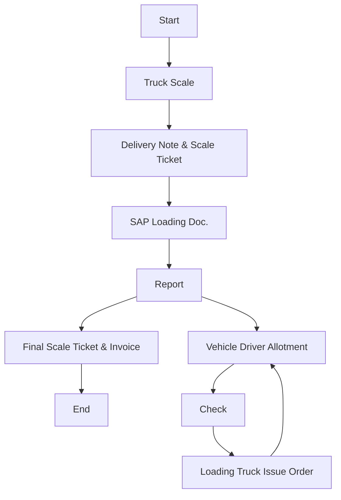

# Policies for Logistics - Packaging Materials & Spare Parts

This section outlines the official logistics policies for moving Packaging Materials and Spare Parts across Arabian Mills. facilities. These items play a critical support role in production continuity and maintenance, and their logistics must be timely, controlled, and fully traceable.
Policies
Request-Driven Movement:
 Packaging and Spare Parts logistics will be executed only upon formal requisition from the relevant support departments (Warehouse, Engineering, or Procurement).
Use of Company-Owned Vehicles:
 All materials under this category will be delivered using Arabian Mills. vehicles or approved fleet, unless alternate arrangements are approved in advance.
Preservation of Material Condition:
 All materials must be transported under secure, covered conditions to prevent exposure to heat, moisture, or mechanical damage.
 Packaging and Spare Parts will be handled in a way that maintains labelling, documentation, and traceability.
Inspection at Dispatch and Receipt:
 Materials will be verified at both loading and offloading points to ensure:
   Quantity accuracy
   Physical condition
   Alignment with the Purchase Order and Delivery Note
Procedure
This procedure defines the step-by-step method used at Arabian Mills. to manage the logistics of Packaging Materials and Spare Parts from central stores or vendors to internal departments or branches. It ensures accuracy, accountability, and documentation at each handoff.

| No. | Responsibility | Procedure Description | Output/Report |
| --- | --- | --- | --- |
| 1 | Head of WH Department | Send delivery order request for Packaging/Spare Parts to the Logistics Coordinator. | Delivery Order |
| 2 | Logistics Coordinator | Review, approve, and plan delivery. Record the request in the logistic spreadsheet log . Check fleet availability. Allocate driver and vehicle. | Delivery Schedule |
| 3 | Driver | Drive to the designated loading point. | Vehicle Positioning |
| 4 | Head of WH Department | Provide driver with Purchase Order and supporting documents. | PO / PR / Delivery Note |
| 5 | Driver | Receive invoice and delivery note from loading point. | Document Collection |
| 6 | Driver | Load Packaging or Spare Parts onto the vehicle. | — |
| 7 | Driver | Transport goods to designated branch or receiving location. | Goods Transit |
| 8 | Branch DC Officer | Inspect material upon arrival and initiate offloading. ( in case there is any shortage to be send official email for Immediate action ) | Receiving Confirmation |
| 9 | Driver | Hand over documentation to Branch DC Officer or Warehouse Head. | Document Handover |
| 10 | Logistics Coordinator | Confirm delivery completion to Logistics Manager and concerned WH department. | E-mail Confirmation |
| 11 | Logistics Manager | Review the full cycle and close the record. | Delivery Report |

Flowchart

**[Diagram — PNG]:**

**Process Name:** Finished Goods Transportation - Packing Material & Spare Parts

**Roles / Swimlanes:**
- Sales
- Weigh-in Scale
- Transportation
- Truck Driver
- FG Warehouse

| Step # | Role           | Action                        | Decision/Next Step             |
|--------|---------------|-------------------------------|--------------------------------|
| 1      | Sales         | Start                         | Truck Scale                    |
| 2      | Weigh-in Scale| Truck Scale                   | Delivery Note & Scale Ticket   |
| 3      | Weigh-in Scale| Delivery Note & Scale Ticket  | SAP Loading Doc.               |
| 4      | Weigh-in Scale| SAP Loading Doc.              | Report                         |
| 5      | Weigh-in Scale| Report                        | Final Scale Ticket & Invoice   |
| 6      | Weigh-in Scale| Final Scale Ticket & Invoice  | End                            |
| 7      | Transportation| Vehicle Driver Allotment      | Check                          |
| 8      | Truck Driver  | Check                         | Loading Truck Issue Order      |
| 9      | FG Warehouse  | Loading Truck Issue Order     | Vehicle Driver Allotment       |

