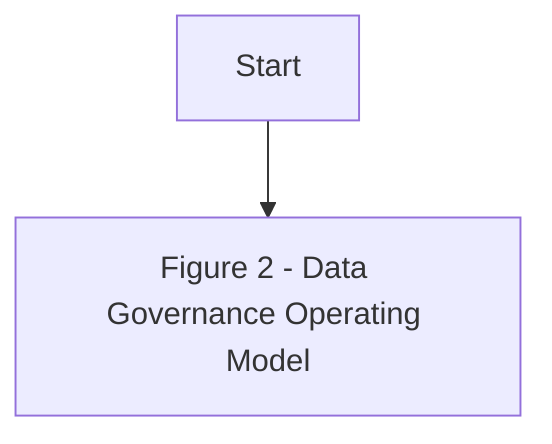

## Effective Date of Policy

The Policy is effective from the date of its approval by the Board of Directors

**[Diagram — PNG]:**

**KSA Data Management and Personal Data Protection Framework**

1. **Data Governance**

   **Data Assetization**
   - 2. Data Catalog and Metadata
   - 3. Data Quality
   - 4. Data Operations
   - 5. Document and Content Mgmt.
   - 6. Data Architecture and Modeling
   - 7. Reference and Master Data Mgmt.

   **Data Usage**
   - 8. Business Intelligence and Analytics
   - 9. Data Sharing and Interoperability
   - 10. Data Value Realization
   - 11. Open Data

**Data Classification and Availability**
- 12. Freedom of Information
- 13. Data Classification

**Data Protection**
- 14. Personal Data Protection
- 15. Data Security and Protection (covered by NCA)


**[Diagram — PNG]:**

- **Board of Directors**
  - **MD**
    - **COO**
      - **Head EDM**
        - **BO**
          - BI and Analytics
        - **DWH**
          - **ETL**
          - **DW & Architecture**
          - Data Sharing and Interoperability
        - **Data Governance**
          - Data Governance, Metadata and Data Catalogue, Data Quality, Reference and Master Data Management, Data Architecture & Modeling, Data Value Realization, Open Data, Freedom of Information
        - **TOD**
          - Data Operations
        - **ETD**
          - Document and Content Management
        - **CISD**
          - Data Classification, Data Security and Protection
        - **Risk**
          - Personal Data Protection
  - **MIS Council**
  - **DG Council**


**[Flowchart — Word Shapes]:**

1. Figure
2. 2
3. – Data Governance Operating Model


**[Flowchart — Structured]:**

```markdown
### Step Table

| Step Number | Description                          | Decision Point | Yes Path | No Path |
|-------------|--------------------------------------|----------------|----------|---------|
| 1           | Start                                |                |          |         |
| 2           | Figure 2 - Data Governance Operating Model |                |          |         |

### Mermaid Diagram

```