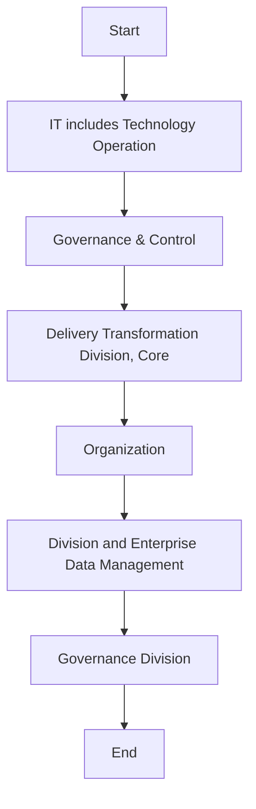

## Data Catalog & Metadata KPIs

Once the new implementation is validated and operational, ongoing measurement of the overall performance and quality of metadata and its management shall take place. Metrics in the form of KPIs shall be defined and developed by the Stewardship team in coordination with the data owner and data architect and shall be used to assess the effectiveness of metadata management.  As a minimum, the following KPIs should be established and measured:

| Category | Metric | Description |
| --- | --- | --- |
| Data Catalog KPIs | Number of registered Data Catalog users | Total number of registered users stored in a D ata C atalog . |
| Data Catalog KPIs | Number of active Data Catalog users | Total number of active users stored in a Data Catalog . |
| Data Catalog KPIs | Number of logins to Data Catalog | Total number of logins stored in a Data Catalog . |
| Metadata Quality KPIs | Metadata repository completeness | Calculated by comparing the ideal coverage of the enterprise Metadata (all artefacts and all instances within scope) to the actual coverage. |
| Metadata Quality KPIs | Metadata repository availability | Uptime and processing time of the systems, which affects data users’ experience in accessing, using, and producing metadata. |
| Metadata Quality KPIs | Metadata documentation quality | A ssess the quality of Metadata documentation through automatic and manual analysis. For example, an automatic analysis could be performed to identify the percentage of attributes that have definitions and measuring trends over time, while a manual analysis could be performed by surveying personnel’s view of the quality (completeness, reliability, currency, etc., of the Metadata in the repository) of metadata available to them. |


**[Flowchart — Word Shapes]:**

1. IT* includes Technology Operation Division, Governance & Control, Delivery Transformation Division, Core
2. Organization
3. ing
4. Division and Enterprise Data Management & Governance Division
5. ing Division and Enterprise Data Management & Governance Division


**[Flowchart — Structured]:**

```markdown
### Step Table

| Step | Description                                                                 |
|------|-----------------------------------------------------------------------------|
| 1    | IT includes Technology Operation Division, Governance & Control, Delivery Transformation Division, Core |
| 2    | Organization                                                                |
| 3    | ing                                                                         |
| 4    | Division and Enterprise Data Management & Governance Division               |
| 5    | ing Division and Enterprise Data Management & Governance Division           |

### Mermaid Diagram


```