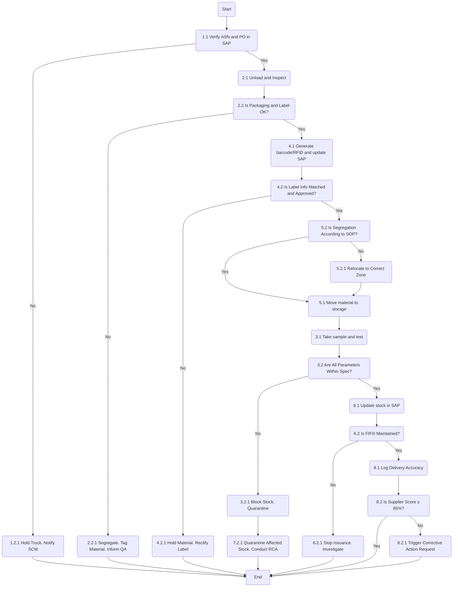

Certainly! Here's the analysis of the flowchart:

### 1. Process Name
- Receipt of Macro and Micro Ingredients

### 2. Roles (Swimlanes)
- Material Planner
- Store Division Head
- QA Analyst
- Procurement Manager

### 3. Steps in a Markdown Table

| Step # | Role                | Action                                                                                   | Next Step/Logic |
|--------|---------------------|------------------------------------------------------------------------------------------|-----------------|
| 1.1    | Material Planner    | Verify Advance Shipping Notice (ASN) and Purchase Order in SAP (M)                      | 1.2             |
| 1.2    | Material Planner    | Is PO Found and Valid?                                                                   | Yes: 2.1, No: 1.2.1 |
| 1.2.1  | Material Planner    | Hold Truck. Notify SCM. Log Deviation (M)                                                | End             |
| 2.1    | Store Division Head | Unload at Designated Bay. Inspect packaging, labeling, and signs of infestation or damage (M) | 2.2             |
| 2.2    | Store Division Head | Is Packaging and Label OK?                                                               | Yes: 4.1, No: 2.2.1  |
| 2.2.1  | Store Division Head | Segregate. Tag Material. Inform QA. Log in SAP (M)                                       | End             |
| 4.1    | Store Division Head | Generate barcode/RFID label with batch info. Affix label and update SAP. (M)             | 4.2             |
| 4.2    | Store Division Head | Is label info matched and status "Approved"?                                             | Yes: 5.2, No: 4.2.1  |
| 4.2.1  | Store Division Head | Hold Material. Rectify Label. Escalate if Repeated (M)                                   | End             |
| 5.2    | Store Division Head | Is segregation according to SOP?                                                         | Yes: 5.1, No: 5.2.1  |
| 5.1    | Store Division Head | Move material to designated silo/storage area based on risk category (M)                 | 3.1             |
| 5.2.1  | Store Division Head | Relocate to Correct Zone. Inspect Other Areas. Log (M)                                   | 5.1             |
| 3.1    | QA Analyst          | Take sample as per SOP. Conduct moisture, aflatoxin, foreign matter, and other tests (M) | 3.2             |
| 3.2    | QA Analyst          | Are all parameters within spec?                                                          | Yes: 6.1, No: 3.2.1  |
| 3.2.1  | QA Analyst          | Block Stock in SAP. Quarantine. Initiate NCR (M)                                         | 7.2.1           |
| 7.2    | QA Analyst          | Are Validation Results Within Limit?                                                     | Yes: 7.1, No: 7.2.1  |
| 7.2.1  | QA Analyst          | Quarantine Affected Stock. Conduct RCA. Update QMS (M)                                   | End             |
| 7.1    | QA Analyst          | Perform periodic check (M)                                                               | 6.1             |
| 6.1    | Material Planner    | Update stock in SAP and bin cards (M)                                                    | 6.2             |
| 6.2    | Material Planner    | Is FIFO Maintained in System & Physically?                                               | Yes: 8.1, No: 6.2.1  |
| 6.2.1  | Material Planner    | Stop Issuance. Investigate. Inform Production Planner (M)                                | End             |
| 8.1    | Procurement Manager | Log delivery accuracy, rejection rate, responsiveness (M)                                | 8.2             |
| 8.2    | Procurement Manager | Is Supplier Score ≥ 85%?                                                                 | Yes: End, No: 8.2.1  |
| 8.2.1  | Procurement Manager | Trigger Corrective Action Request. Review Meeting (M)                                    | End             |

### 4. Logic as a Mermaid.js Code Block

