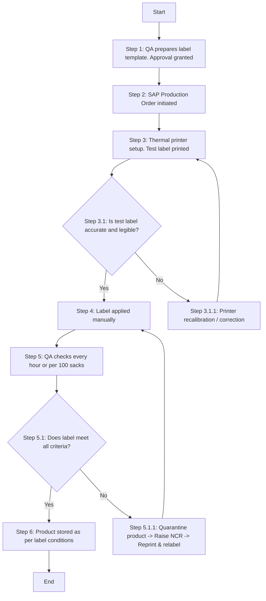

### 1. Process Name
Product Labeling

### 2. Roles (Swimlanes)
- QA Analyst / Production Planner

### 3. Steps in a Markdown Table

| Step #  | Role                          | Action                                                                                   | Next Step/Logic                         |
|---------|-------------------------------|------------------------------------------------------------------------------------------|-----------------------------------------|
| 1       | QA Analyst / Production Planner | QA prepares label template. Cross-functional review. Approval granted (M)                | Step 2                                  |
| 2       | QA Analyst / Production Planner | SAP Production Order initiated. Label format auto-generated with batch data (A)          | Step 3                                  |
| 3       | QA Analyst / Production Planner | Thermal printer setup. Test label printed (A)                                            | Step 3.1                                |
| 3.1     | QA Analyst / Production Planner | Is test label accurate and legible?                                                      | Yes: Step 4, No: Step 3.1.1             |
| 3.1.1   | QA Analyst / Production Planner | Printer recalibration / correction (A)                                                   | Step 3                                  |
| 4       | QA Analyst / Production Planner | Label applied manually or via applicator. Proper placement verified. Sack/carton sealed (M) | Step 5                                  |
| 5       | QA Analyst / Production Planner | QA checks every hour or per 100 sacks (M)                                                | Step 5.1                                |
| 5.1     | QA Analyst / Production Planner | Does label meet all criteria?                                                            | Yes: Step 6, No: Step 5.1.1             |
| 5.1.1   | QA Analyst / Production Planner | Quarantine product -> Raise NCR -> Reprint & relabel (M)                                 | Step 4                                  |
| 6       | QA Analyst / Production Planner | Product stored as per label conditions. FEFO principles applied. Dispatch executed via SAP (M) | End                                     |

### 4. Mermaid.js Code Block

