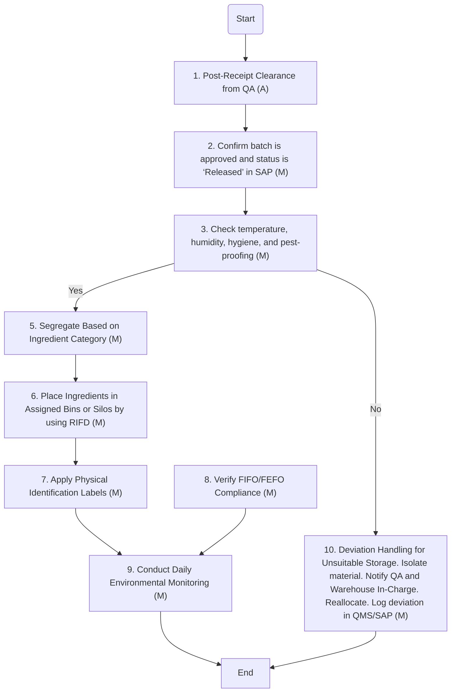

### Analysis of the Flowchart

#### 1. Process Name
- Storage of Incoming Macro and Micro Ingredients

#### 2. Roles (Swimlanes)
- Store Division Head / QA Analyst
- Material Planner

#### 3. Steps in a Markdown Table

| Step # | Role                            | Action                                                                                     | Next Step/Logic                  |
|--------|---------------------------------|--------------------------------------------------------------------------------------------|----------------------------------|
| 1      | Store Division Head / QA Analyst | Post-Receipt Clearance from QA (A)                                                         | Step 2                           |
| 2      | Store Division Head / QA Analyst | Confirm batch is approved and status is ‘Released’ in SAP (M)                              | Step 3                           |
| 3      | Store Division Head / QA Analyst | Check temperature, humidity, hygiene, and pest-proofing (M)                                | Step 4                           |
| 4      | Store Division Head / QA Analyst | Is the Storage Area Suitable?                                                              | Yes: Step 5, No: Step 10         |
| 5      | Store Division Head / QA Analyst | Segregate Based on Ingredient Category (M)                                                 | Step 6                           |
| 6      | Store Division Head / QA Analyst | Place Ingredients in Assigned Bins or Silos by using RIFD (M)                              | Step 7                           |
| 7      | Store Division Head / QA Analyst | Apply Physical Identification Labels (M)                                                   | Step 9                           |
| 8      | Material Planner                | Verify FIFO/FEFO Compliance (M)                                                            | Step 9                           |
| 9      | Store Division Head / QA Analyst | Conduct Daily Environmental Monitoring (M)                                                 | End                              |
| 10     | Store Division Head / QA Analyst | Deviation Handling for Unsuitable Storage. Isolate material. Notify QA and Warehouse In-Charge. Reallocate. Log deviation in QMS/SAP (M) | End                              |

#### 4. Logic as Mermaid.js Code Block

This logic provides a clear flow of the process as described in the flowchart using Mermaid.js for visualization.