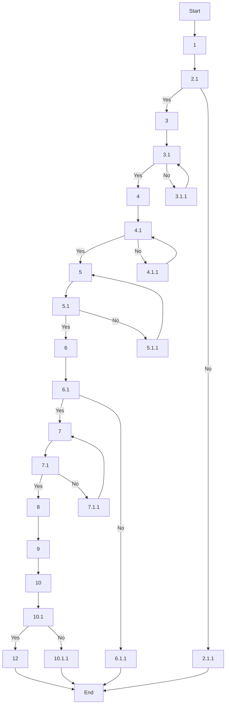

### Analysis of the Flowchart

#### 1. Process Name:
- Macro Dosing & Mixing (Batching)

#### 2. Roles (Swimlanes):
- Store Division Head / Material Planner
- QA / Production (for respective tasks)

#### 3. Markdown Table:

| Step # | Role | Action | Next Step/Logic |
|--------|------|--------|-----------------|
| Start | A | Batch production planning initiated. | 1 |
| 1 | M | Validate Bill of Materials (BOM) and batch formulation. | 2.1 |
| 2.1 | M | Is the Production Order complete and BOM accurate? | Yes: 3; No: 2.1.1 |
| 2.1.1 | M | Halt process and notify Planning Team. | End |
| 3 | M | Segregate macro ingredients by risk category. Ensure silos/bins are labeled correctly. | 3.1 |
| 3.1 | M | Is segregation and labeling compliant? | Yes: 4; No: 3.1.1 |
| 3.1.1 | M | Re-label bins, relocate material, and inform QA. | 3.1 |
| 4 | M | Schedule batches from low-risk to high-risk. Obtain QA approval. | 4.1 |
| 4.1 | M | Is sequencing validated? | Yes: 5; No: 4.1.1 |
| 4.1.1 | M | Perform cleaning, validate sequence, reschedule batch. | 4.1 |
| 5 | M | Perform flushing using validated material. Conduct ATP or allergen swab tests. | 5.1 |
| 5.1 | M | Is flushing validated? | Yes: 6; No: 5.1.1 |
| 5.1.1 | M | Repeat cleaning and retesting. | 5 |
| 6 | M | Perform internal calibration and verify external certificate | 6.1 |
| 6.1 | M | Is calibration within acceptable range? | Yes: 7; No: 6.1.1 |
| 6.1.1 | M | Lock scale and inform Maintenance. | End |
| 7 | M | Weigh ingredients per SAP-defined recipe. Cross-check with SAP interface. | 7.1 |
| 7.1 | M | Is weight accurate and ingredient verified? | Yes: 8; No: 7.1.1 |
| 7.1.1 | M | Discard incorrect weight and reweigh. | 7 |
| 8 | M | Load in the correct sequence to avoid segregation. | 9 |
| 9 | M | Run mixer for validated time and speed as per SOP. | 10 |
| 10 | A | QA checks for proper dosing, sequencing, and mixing parameters. | 10.1 |
| 10.1 | M | All QA checks passed? | Yes: 12; No: 10.1.1 |
| 10.1.1 | M | Hold batch and initiate deviation protocol. | End |
| 11 | M | Perform root cause analysis. Implement corrective and preventive actions (CAPA). | End |
| 12 | M | Conduct allergen testing, validate cleaning, and update allergen risk map. | End |

#### 4. Mermaid.js Code Block:

This representation covers the flow and decision points within the process, tracing each step by its role and corresponding actions.