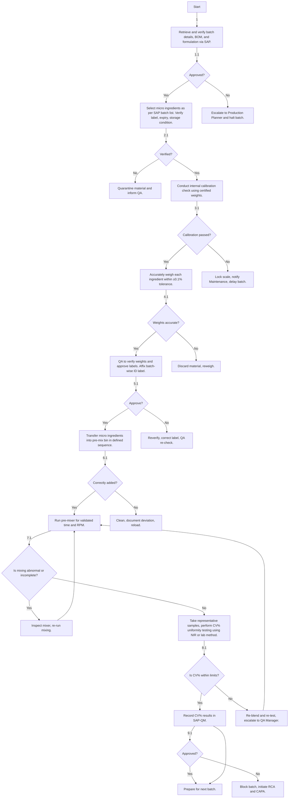

### Analysis

#### 1. Process Name
- Micro Dosing & Mixing

#### 2. Roles (Swimlanes)
- QA / Production (for respective tasks)

#### 3. Steps into Markdown Table

| Step # | Role   | Action                                                                                 | Next Step/Logic                                            |
|--------|--------|----------------------------------------------------------------------------------------|------------------------------------------------------------|
| 1      | M      | Retrieve and verify batch details, BOM, and formulation via SAP.                        | 1.1                                                        |
| 1.1    | M      | Approved?                                                                              | Yes: 2 / No: 1.11                                          |
| 1.11   | M      | Escalate to Production Planner and halt batch.                                         | End                                                        |
| 2      | M      | Select micro ingredients as per SAP batch list. Verify label, expiry, and storage.     | 2.1                                                        |
| 2.1    | M      | Verified?                                                                              | Yes: 3 / No: 2.1.1                                         |
| 2.1.1  | M      | Quarantine material and inform QA.                                                     | End                                                        |
| 3      | M      | Conduct internal calibration check using certified weights.                            | 3.1                                                        |
| 3.1    | M      | Calibration passed?                                                                    | Yes: 4 / No: 3.1.1                                         |
| 3.1.1  | M      | Lock scale, notify Maintenance, and delay batch.                                       | End                                                        |
| 4      | M      | Accurately weigh each ingredient within ±0.1% tolerance.                               | 4.1                                                        |
| 4.1    | M      | Weights accurate?                                                                      | Yes: 5 / No: 4.1.1                                         |
| 4.1.1  | M      | Discard material, reweigh.                                                             | 4                                                          |
| 5      | M      | QA to verify weights and approve labels. Affix batch-wise identification label.        | 5.1                                                        |
| 5.1    | M      | Approve?                                                                               | Yes: 6 / No: 5.1.1                                         |
| 5.1.1  | M      | Reverify, correct label, QA re-check.                                                  | 5                                                          |
| 6      | M      | Transfer micro ingredients into pre-mix bin in defined sequence.                       | 6.1                                                        |
| 6.1    | M      | Correctly added?                                                                       | Yes: 7 / No: 6.1.1                                         |
| 6.1.1  | M      | Clean, document deviation, and reload.                                                 | 6                                                          |
| 7      | M      | Run pre-mixer for validated time and RPM.                                              | 7.1                                                        |
| 7.1    | M      | Is mixing abnormal or incomplete?                                                      | Yes: 7.1.1 / No: 8                                         |
| 7.1.1  | M      | Inspect mixer, re-run mixing.                                                          | 7                                                          |
| 8      | M      | Take representative samples, perform CV% uniformity testing using NIR or lab method.   | 8.1                                                        |
| 8.1    | M      | Is CV% within limits?                                                                  | Yes: 9 / No: 8.1.1                                         |
| 8.1.1  | M      | Re-blend and re-test, escalate to QA Manager.                                          | 7                                                          |
| 9      | M      | Record CV% results in SAP-QM.                                                          | 9.1                                                        |
| 9.1    | M      | Approved?                                                                              | Yes: 10.1.2 / No: 9.1.1                                    |
| 9.1.1  | M      | Block batch, initiate RCA and CAPA.                                                    | End                                                        |
| 10     | M      | Post-batch cleaning validation (visual + ELISA swab). Record cleaning status.          | 10.1                                                       |
| 10.1   | M      | Passed?                                                                                | Yes: 10.1.2 / No: 10.1.1                                   |
| 10.1.1 | M      | Re-clean, re-test, QA approval required.                                               | 10                                                         |
| 10.1.2 | M      | Prepare for next batch.                                                                | End                                                        |

#### 4. Logic as Mermaid.js Code Block

