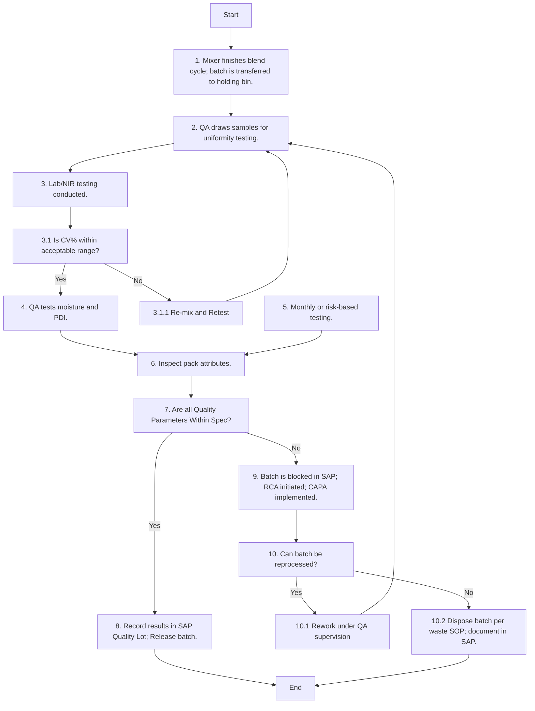

### Analysis of the Flowchart

1. **Process Name**: Finished Product Quality

2. **Roles (Swimlanes)**:
   - **QA Analyst / Data Entry Operator**

3. **Steps in Markdown Table**:

| Step # | Role                        | Action                                                                 | Next Step/Logic               |
|--------|-----------------------------|------------------------------------------------------------------------|-------------------------------|
| 1      | A                           | Mixer finishes blend cycle; batch is transferred to holding bin.       | 2                             |
| 2      | M                           | QA draws samples for uniformity testing.                               | 3                             |
| 3      | A                           | Lab/NIR testing conducted.                                             | 3.1                           |
| 3.1    | M                           | Is CV% within acceptable range?                                        | Yes: 4 / No: 3.1.1            |
| 3.1.1  | M                           | Re-mix and Retest                                                      | 2                             |
| 4      | M                           | QA tests moisture and Pellet Durability Index.                         | 6                             |
| 5      | A                           | Monthly or risk-based testing.                                         | 6                             |
| 6      | M                           | Inspect pack integrity, seal strength, label accuracy, barcode, net weight. | 7                         |
| 7      | M                           | Are all Quality Parameters Within Spec?                                | Yes: 8 / No: 9                |
| 8      | M                           | Record results in SAP Quality Lot; Release batch.                      | End                           |
| 9      | M                           | Batch is blocked in SAP; RCA initiated; CAPA implemented.              | 10                            |
| 10     | M                           | Can batch be reprocessed?                                              | Yes: 10.1 / No: 10.2          |
| 10.1   | M                           | Rework under QA supervision                                            | 2                             |
| 10.2   | M                           | Dispose batch per waste SOP; document in SAP.                          | End                           |

4. **Mermaid.js Code Block**:

This outlines the flowchart's steps and decision points clearly for analysis and communication within the organization.