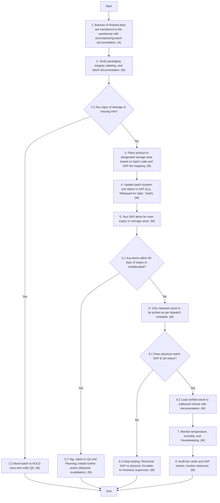

### Analysis

#### Process Name:
- Storage and Inventory Management of Finished Feed

#### Roles:
- Store Division Head
- QA Analyst 
- Data Entry Operator

#### Markdown Table

| Step # | Role                       | Action                                                                                     | Next Step/Logic               |
|--------|----------------------------|--------------------------------------------------------------------------------------------|-------------------------------|
| 1      | Store Division Head        | Batches of finished feed are transferred to the warehouse with accompanying batch documentation. | Step 2                        |
| 2      | QA Analyst                 | Verify packaging integrity, labeling, and batch documentation.                             | Step 2.1                      |
| 2.1    | QA Analyst                 | Any signs of damage or missing info?                                                        | Yes: Step 2.2, No: Step 3     |
| 2.2    | QA Analyst                 | Move batch to HOLD area and notify QA.                                                      | End                           |
| 3      | QA Analyst                 | Place product in designated storage area based on batch code and SAP bin mapping.           | Step 4                        |
| 4      | QA Analyst                 | Update batch location and status in SAP (e.g., "Released for Sale", "Hold").                | Step 5                        |
| 5      | QA Analyst                 | Run SAP alerts for near-expiry or overage stock.                                            | Step 5.1                      |
| 5.1    | QA Analyst                 | Any items within 60 days of expiry or misallocated?                                         | Yes: Step 5.2, No: Step 6     |
| 5.2    | QA Analyst                 | Tag, report to QA and Planning; initiate further action (disposal, revalidation).           | End                           |
| 6      | Data Entry Operator        | Only released stock to be picked as per dispatch schedule.                                  | Step 6.1                      |
| 6.1    | Data Entry Operator        | Does physical match SAP & QA status?                                                       | Yes: Step 6.2, No: Step 6.3   |
| 6.2    | Data Entry Operator        | Load verified stock to outbound vehicle with documentation.                                | Step 7                        |
| 6.3    | Data Entry Operator        | Stop loading. Reconcile SAP vs physical. Escalate to Inventory Supervisor.                 | End                           |
| 7      | QA Analyst / Data Entry Operator | Monitor temperature, humidity, and housekeeping.                                           | Step 8                        |
| 8      | QA Analyst / Data Entry Operator | Audit bin cards and SAP entries; resolve variances.                                        | End                           |

#### Mermaid.js Code Block

