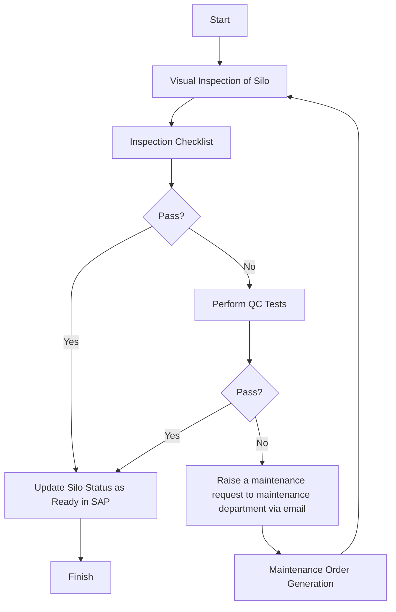

### Analysis of Flowchart

1. **Process Name**: Raw Wheat Receipt into Silos - Pre-Transfer Inspection of Silos

2. **Roles (Swimlanes)**:
   - Silo Operator
   - QA Analyst
   - Data Entry Operator

3. **Steps in a Markdown Table**:

| Step # | Role                | Action                                                  | Next Step/Logic                                       |
|--------|---------------------|---------------------------------------------------------|-------------------------------------------------------|
| 1      | Silo Operator       | Start                                                   | Step 2                                                |
| 2      | Silo Operator       | Visual Inspection of Silo                               | Step 3                                                |
| 3      | Silo Operator       | Inspection Checklist                                    | Step 4                                                |
| 4      | Silo Operator       | Pass?                                                   | Yes: Step 7 / No: Step 5                              |
| 5      | QA Analyst          | Perform QC Tests                                        | Step 6                                                |
| 6      | QA Analyst          | Pass?                                                   | Yes: Step 7 / No: Step 8                              |
| 7      | QA Analyst          | Update Silo Status as Ready in SAP                      | Step 9                                                |
| 8      | Data Entry Operator | Raise a maintenance request to maintenance department via email | Step 9                                                |
| 9      | Data Entry Operator | Maintenance Order Generation                            | Back to Step 2                                        |
| 10     | QA Analyst          | Finish                                                  | End                                                   |

4. **Mermaid.js Code Block**:

**Explanation**: The flowchart represents a process for inspecting silos before transferring raw wheat. If either the initial visual inspection or subsequent quality control tests pass, the silo status is updated. If not, a maintenance request is initiated.