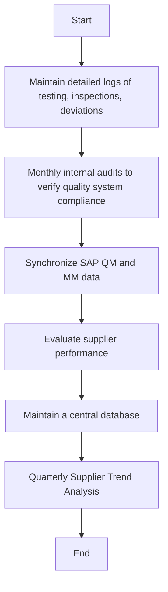

### Analysis of the Flowchart

#### 1. Process Name
- Raw Wheat Receipt into Silos

#### 2. Roles (Swimlanes)
- QA Analyst
- Internal Auditor
- Data Entry Operator
- Procurement Manager

#### 3. Steps in a Markdown Table

| Step # | Role              | Action                                                | Next Step/Logic                      |
|--------|-------------------|-------------------------------------------------------|--------------------------------------|
| 1      | QA Analyst        | Maintain detailed logs of testing, inspections, deviations | Step 2                               |
| 2      | Internal Auditor  | Monthly internal audits to verify quality system compliance | Step 3                               |
| 3      | Data Entry Operator | Synchronize SAP QM and MM data                      | Step 4                               |
| 4      | Procurement Manager | Evaluate supplier performance                       | Step 5                               |
| 5      | Procurement Manager | Maintain a central database                         | Step 6                               |
| 6      | Procurement Manager | Quarterly Supplier Trend Analysis                   | End                                  |

#### 4. Logic in Mermaid.js Code Block

