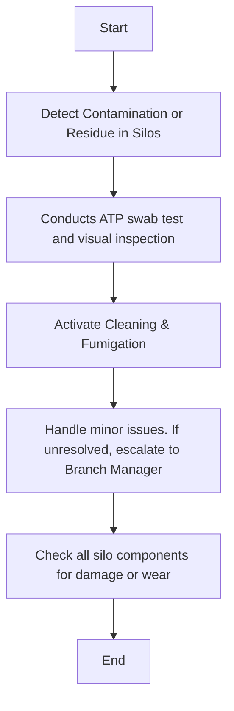

Sure! Here’s the analysis:

### 1. Process Name:
- Emergency Procedures for Silo Contamination or System Failure

### 2. Roles (Swimlanes):
- Silo Operator
- QA
- Engineering Coordinator

### 3. Steps in a Markdown Table:

| Step # | Role                 | Action                                                      | Next Step/Logic                                 |
|--------|----------------------|-------------------------------------------------------------|-------------------------------------------------|
| 1      | Silo Operator        | Detect Contamination or Residue in Silos                    | Step 2                                          |
| 2      | QA                   | Conducts ATP swab test and visual inspection                | Step 3                                          |
| 3      | QA                   | Activate Cleaning & Fumigation                              | Step 4                                          |
| 4      | QA                   | Handle minor issues. If unresolved, escalate to Branch Manager | Step 5                                          |
| 5      | Engineering Coordinator | Check all silo components for damage or wear                | End                                             |

### 4. Mermaid.js Code:

This representation outlines the sequence and roles involved in the emergency procedures workflow.