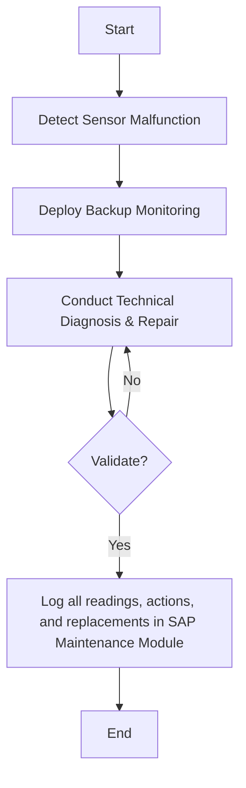

### 1. Process Name
Emergency Procedures: Sensor Malfunction or Calibration Failure

### 2. Roles (Swimlanes)
- Silo Operator
- Automation Engineer
- QA Analyst
- Data Entry Operator

### 3. Steps in a Markdown Table

| Step # | Role                 | Action                                                            | Next Step/Logic                                         |
|--------|----------------------|-------------------------------------------------------------------|---------------------------------------------------------|
| 1      | Silo Operator        | Detect Sensor Malfunction                                         | Step 2                                                  |
| 2      | Silo Operator        | Deploy Backup Monitoring                                          | Step 3                                                  |
| 3      | Automation Engineer  | Conduct Technical Diagnosis & Repair                              | Step 4 - Decision Point: Validate?                      |
| 4      | QA Analyst           | Validate?                                                         | Yes: Step 5; No: Step 3                                 |
| 5      | Data Entry Operator  | Log all readings, actions, and replacements in SAP Maintenance Module | End                                                   |

### 4. Logic as Mermaid.js Code Block

