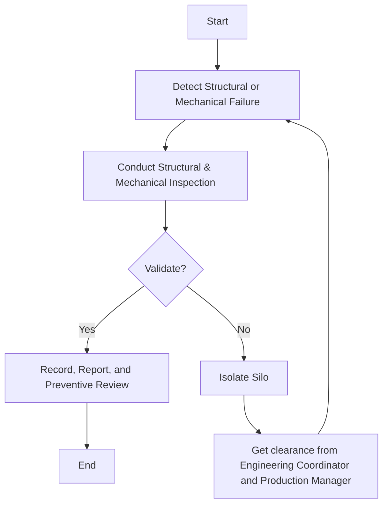

Certainly! Here's the analyzed information from the flowchart:

### 1. Process Name:
**Emergency Procedures: Structural Damage or Mechanical Malfunction**

### 2. Roles (Swimlanes):
- Silo Operator
- Engineering Coordinator
- QA Specialist

### 3. Steps in Markdown Table:

| Step # | Role                   | Action                                                | Next Step/Logic                                     |
|--------|------------------------|-------------------------------------------------------|-----------------------------------------------------|
| 1      | Silo Operator          | Detect Structural or Mechanical Failure               | Step 2                                              |
| 2      | Silo Operator          | Conduct Structural & Mechanical Inspection            | Step 3                                              |
| 3      | Engineering Coordinator| Validate?                                             | Yes: Step 5, No: Step 4                             |
| 4      | Silo Operator          | Isolate Silo                                          | Step 6                                              |
| 5      | QA Specialist          | Record, Report, and Preventive Review                 | Step 6                                              |
| 6      | Engineering Coordinator| Get clearance from Engineering Coordinator and Production Manager | Step 2                                         |

### 4. Mermaid.js Code Block:

This breakdown captures the decision-making paths and actions performed by different roles as depicted in the flowchart.