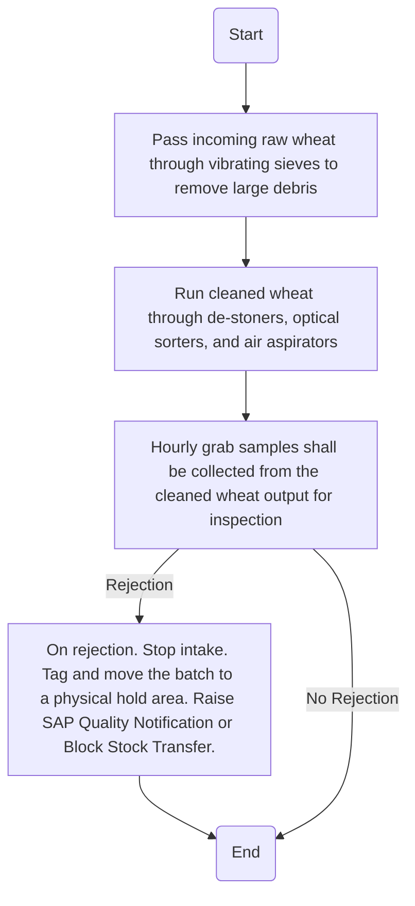

### Analysis of Flowchart

1. **Process Name:**
   - Processing / Milling Operation

2. **Roles (Swimlanes):**
   - Mill Operator
   - QA Specialist

3. **Steps in Markdown Table:**

| Step # | Role          | Action                                                                 | Next Step/Logic                                                   |
|--------|---------------|------------------------------------------------------------------------|-------------------------------------------------------------------|
| 1      | Mill Operator | Start                                                                  | 2                                                                 |
| 2      | Mill Operator | Pass incoming raw wheat through vibrating sieves to remove large debris | 3                                                                 |
| 3      | Mill Operator | Run cleaned wheat through de-stoners, optical sorters, and air aspirators | 4                                                                 |
| 4      | QA Specialist | Hourly grab samples shall be collected from the cleaned wheat output for inspection | 5 (If rejection, then execute Step 5 and End)                      |
| 5      | QA Specialist | On rejection. Stop intake. Tag and move the batch to a physical hold area. Raise SAP Quality Notification or Block Stock Transfer. | End                                                               |
| 6      | QA Specialist | End                                                                    | -                                                                 |

4. **Mermaid.js Code Block:**

This representation captures the flow of actions, including the decision path for rejections.