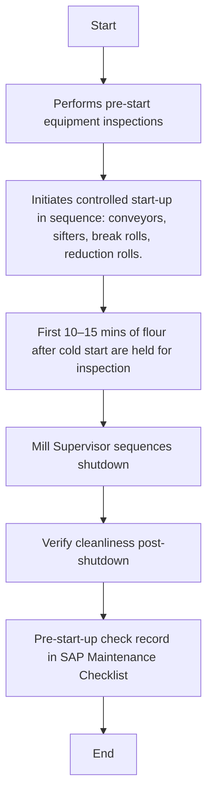

### Analysis

#### 1. Process Name
- Milling Start-Up & Shutdown Protocol

#### 2. Roles (Swimlanes)
- Mill Supervisor
- Mill Operator
- QA Analyst
- Data Entry Operator

#### 3. Steps Extracted

| Step # | Role                | Action                                                                                                 | Next Step/Logic                                                                   |
|--------|---------------------|--------------------------------------------------------------------------------------------------------|-----------------------------------------------------------------------------------|
| 1      | Mill Supervisor     | Performs pre-start equipment inspections                                                              | Step 2                                                                            |
| 2      | Mill Operator       | Initiates controlled start-up in sequence: conveyors, sifters, break rolls, reduction rolls.           | Step 3                                                                            |
| 3      | QA Analyst          | First 10–15 mins of flour after cold start are held for inspection                                     | Step 4                                                                            |
| 4      | Mill Supervisor     | Mill Supervisor sequences shutdown: reduction, break, sifters, conveyors. Residual product is cleared | Step 5                                                                            |
| 5      | QA Analyst          | Verify cleanliness post-shutdown. ATP tests if stop > 12 hrs. Ensure no pest ingress risk during downtime | Step 6                                                                            |
| 6      | Data Entry Operator | Pre-start-up check record in SAP Maintenance Checklist. First Flour Hold logged in SAP QM. Equipment status update in SAP PM post-shutdown. | End                                                                              |

#### 4. Mermaid.js Code Block

