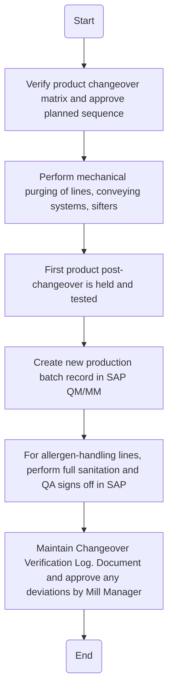

### Analysis of the Flowchart

1. **Process Name:** Processing / Milling Operation

2. **Roles (Swimlanes):**
   - QA Manager
   - Mill Operator
   - QA Analyst
   - Data Entry Operator
   - QA Specialist

3. **Steps in Markdown Table:**

| Step # | Role              | Action                                                                                 | Next Step/Logic                        |
|--------|-------------------|----------------------------------------------------------------------------------------|----------------------------------------|
| 1      | QA Manager        | Verify product changeover matrix and approve planned sequence.                         | Go to Step 2                           |
| 2      | Mill Operator     | Perform mechanical purging of lines, conveying systems, sifters.                       | Go to Step 3                           |
| 3      | QA Analyst        | First product post-changeover is held and tested.                                      | Go to Step 4                           |
| 4      | Data Entry Operator | Create new production batch record in SAP QM/MM.                                       | Go to Step 5                           |
| 5      | QA Specialist     | For allergen-handling lines, perform full sanitation and QA signs off in SAP.          | Go to Step 6                           |
| 6      | QA Specialist     | Maintain Changeover Verification Log. Document and approve any deviations by Mill Manager. | End                                    |

4. **Mermaid.js Code Block:**

This analysis provides a structured overview of the flowchart, detailing each role, action, and the sequence of steps within the given process.