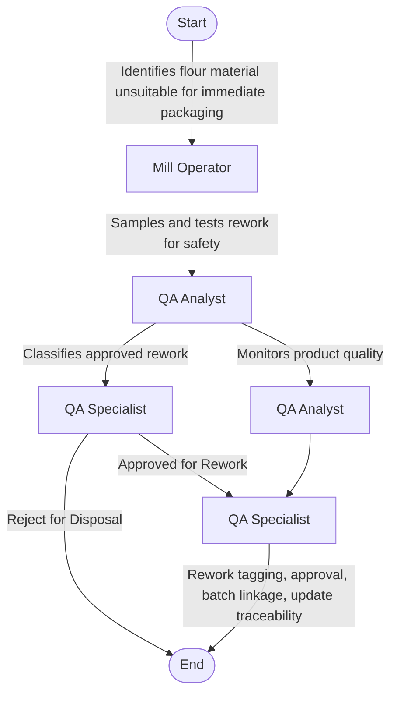

### Analysis

1. **Process Name:** Processing / Milling Operation
2. **Roles (Swimlanes):**
   - Mill Operator
   - QA Analyst
   - QA Specialist

3. **Steps in Markdown Table:**

| Step # | Role          | Action                                                                                                   | Next Step / Logic                                                                                                                         |
|--------|---------------|----------------------------------------------------------------------------------------------------------|-------------------------------------------------------------------------------------------------------------------------------------------|
| 1      | Mill Operator | Identifies flour material unsuitable for immediate packaging                                             | Step 2                                                                                                                                   |
| 2      | QA Analyst    | Samples and tests rework for safety                                                                      | Step 3A: "Classifies approved rework" OR Step 3B: "Monitors product quality"                                                             |
| 3A     | QA Specialist | Classifies approved rework as: "Approved for Rework" / "Reject for Disposal". Updates SAP MM and QM records | If "Approved for Rework", then Step 4; If "Reject for Disposal", process ends                                                            |
| 3B     | QA Analyst    | Monitors product quality after rework addition (moisture, granulation, contamination)                    | Step 4                                                                                                                                   |
| 4      | QA Specialist | Rework tagging, approval, batch linkage, update final product batch traceability in SAP MM/QM             | End                                                                                                                                      |

4. **Mermaid.js Code Block:**

This outlines the logical flow and roles for the "Processing / Milling Operation" process.