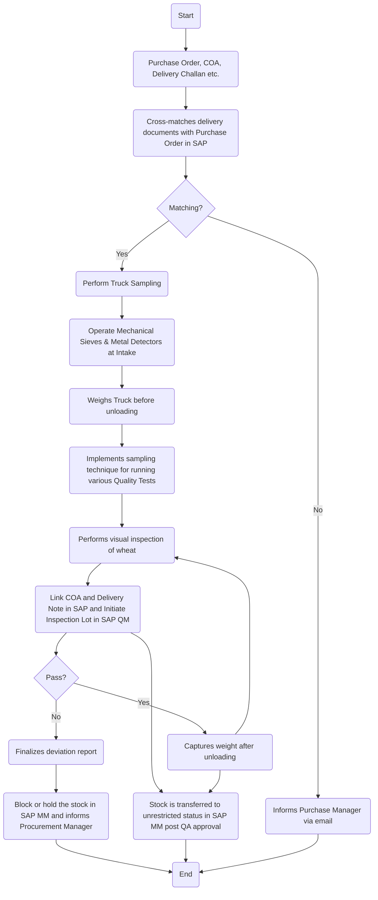

### Analysis of the Flowchart Image

1. **Process Name**: Raw Wheat Receipt into Silos

2. **Roles (Swimlanes)**:
   - Silo Operator
   - Weight Bridge Operator
   - QA Analyst
   - Data Entry Operator

3. **Markdown Table**:

| Step # | Role                  | Action                                                                                  | Next Step/Logic                |
|--------|-----------------------|-----------------------------------------------------------------------------------------|--------------------------------|
| 1      | Silo Operator         | Start                                                                                    | 2                              |
| 2      | Silo Operator         | Purchase Order, COA, Delivery Challan etc.                                              | 3                              |
| 3      | Silo Operator         | Cross-matches delivery documents with Purchase Order in SAP                              | 4                              |
| 4      | Silo Operator         | Matching?                                                                                | Yes: 5  No: 6                  |
| 5      | Silo Operator         | Perform Truck Sampling                                                                  | 7                              |
| 6      | Silo Operator         | Informs Purchase Manager via email                                                      | End                            |
| 7      | Silo Operator         | Operate Mechanical Sieves & Metal Detectors at Intake                                   | 8                              |
| 8      | Weight Bridge Operator| Weighs Truck before unloading                                                            | 9                              |
| 9      | QA Analyst            | Implements sampling technique for running various Quality Tests                         | 10                             |
| 10     | QA Analyst            | Performs visual inspection of wheat                                                     | 11                             |
| 11     | QA Analyst            | Link COA and Delivery Note in SAP and Initiate Inspection Lot in SAP QM                 | 12                             |
| 12     | QA Analyst            | Stock is transferred to unrestricted status in SAP MM post QA approval                  | End                            |
| 13     | QA Analyst            | Pass?                                                                                    | Yes: 14  No: 15                |
| 14     | Weight Bridge Operator| Captures weight after unloading                                                          | 11                             |
| 15     | QA Analyst            | Finalizes deviation report                                                              | End                            |
| 16     | Data Entry Operator   | Create Goods Receipt Note (GRN) in SAP MM                                               | 11                             |
| 17     | QA Analyst            | Block or hold the stock in SAP MM and informs Procurement Manager                        | End                            |

4. **Mermaid.js Code Block**:

