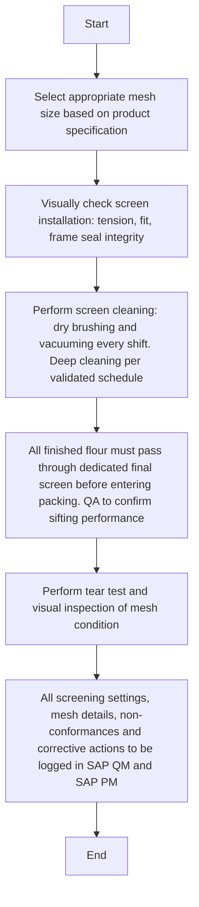

### Analysis

#### 1. Process Name:
- Processing / Milling Operation

#### 2. Roles (Swimlanes):
- Head Miller
- Sifter Operator
- QA Analyst
- QA Specialist

#### 3. Steps Table:

| Step # | Role           | Action                                                                 | Next Step/Logic                  |
|--------|----------------|------------------------------------------------------------------------|----------------------------------|
| 1      | Head Miller    | Select appropriate mesh size based on product specification.            | Step 2                           |
| 2      | Sifter Operator| Visually check screen installation: tension, fit, frame seal integrity. | Step 3                           |
| 3      | Sifter Operator| Perform screen cleaning: dry brushing and vacuuming every shift. Deep cleaning per validated schedule. | Step 4                           |
| 4      | QA Analyst     | All finished flour must pass through dedicated final screen before entering packing. QA to confirm sifting performance. | Step 5                           |
| 5      | QA Analyst     | Perform tear test and visual inspection of mesh condition.              | Step 6                           |
| 6      | QA Specialist  | All screening settings, mesh details, non-conformances and corrective actions to be logged in SAP QM and SAP PM. | End                              |

#### 4. Mermaid.js Code:

