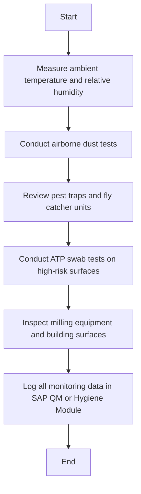

Sure, here is the analysis of the flowchart:

### 1. Process Name
- Processing / Milling Operation

### 2. Roles (Swimlanes)
- QA Analyst
- Mill Operator
- QA Specialist

### 3. Steps Extracted into a Markdown Table

| Step # | Role         | Action                                                                     | Next Step/Logic                                                   |
|--------|--------------|----------------------------------------------------------------------------|-------------------------------------------------------------------|
| 1      | QA Analyst   | Measure ambient temperature and relative humidity using calibrated devices. Maintain temp to prevent microbial growth. | 2                                                                 |
| 2      | QA Analyst   | Conduct airborne dust tests in critical milling areas using settle plates or particle counters. | 3                                                                 |
| 3      | QA Analyst   | Review pest traps and fly catcher units. Inspect for pest activity (insects, rodents). | 4                                                                 |
| 4      | QA Analyst   | Conduct ATP swab tests on high-risk surfaces.                                   | 5                                                                 |
| 5      | Mill Operator| Inspect milling equipment and building surfaces for condensation points.            | 6                                                                 |
| 6      | QA Specialist| All monitoring data to be logged in SAP QM or Hygiene Module for traceability. | End                                                               |

### 4. Mermaid.js Code Block

This flowchart outlines an environmental monitoring process in milling areas, starting with environmental checks and concluding with data logging for traceability.