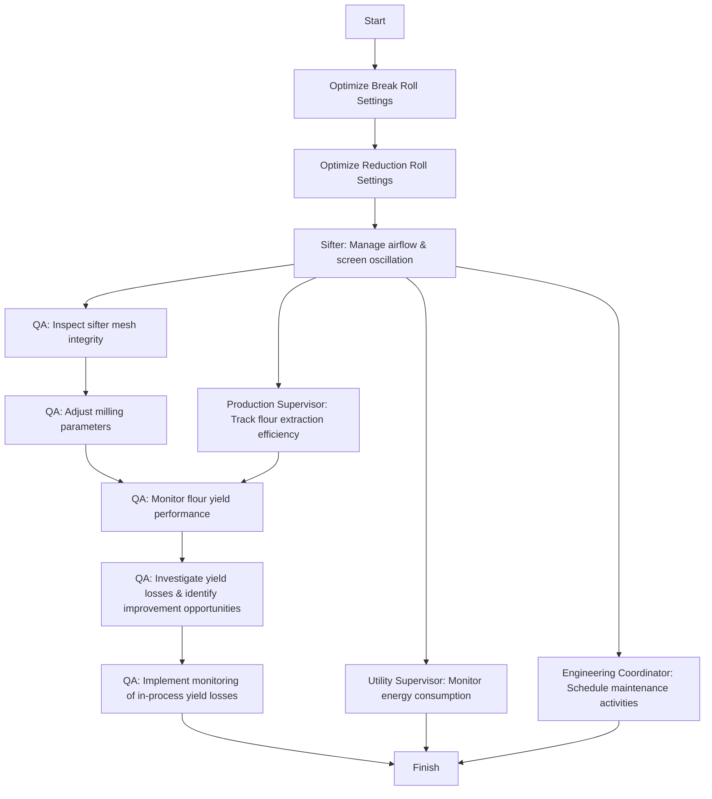

Certainly! Let's break down the flowchart:

### 1. Process Name
- **Yield Optimization**

### 2. Roles (Swimlanes)
- Mill Operator
- Sifter Operator
- QA
- Production Supervisor
- Utility Supervisor
- Engineering Coordinator

### 3. Steps in a Markdown Table

| Step # | Role                  | Action                                                                                       | Next Step/Logic                                                                                           |
|--------|-----------------------|----------------------------------------------------------------------------------------------|-----------------------------------------------------------------------------------------------------------|
| 1      | Mill Operator         | Start                                                                                        | Optimize Break Roll Settings                                                                              |
| 2      | Mill Operator         | Optimize Break Roll Settings                                                                 | Optimize Reduction Roll Settings                                                                          |
| 3      | Mill Operator         | Optimize Reduction Roll Settings                                                             | Sifter Operator: Manages airflow rate and screen oscillation of purifiers                                 |
| 4      | Sifter Operator       | Manages airflow rate and screen oscillation of purifiers                                     | QA: QA Analyst inspects sifter mesh integrity and verifies mesh aperture sizes                             |
| 5      | QA                    | QA Analyst inspects sifter mesh integrity and verifies mesh aperture sizes                    | Collaboratively adjust milling parameters, optimize performance                                           |
| 6      | QA                    | Collaboratively adjust milling parameters, optimize performance                             | Monitors flour yield performance against SAP targets and trend reports.                                   |
| 7      | QA                    | Monitors flour yield performance against SAP targets and trend reports.                      | Leads investigations into recurring yield losses or deviations. Process improvement opportunities identified |
| 8      | QA                    | Leads investigations into recurring yield losses or deviations. Process improvement opportunities identified | Implement continuous monitoring of in-process yield losses                                             |
| 9      | QA                    | Implement continuous monitoring of in-process yield losses                                   | Finish                                                                                                     |
| 10     | Production Supervisor | Tracks flour extraction efficiency using SAP batch records and weighbridge outputs           | Monitors flour yield performance against SAP targets and trend reports.                                   |
| 11     | Utility Supervisor    | Monitors energy consumption per ton of wheat processed using SAP dashboards                  | Finish                                                                                                     |
| 12     | Engineering Coordinator| Schedules preventive maintenance activities, and machine alignment using SAP PM module      | Finish                                                                                                     |

### 4. Logic in Mermaid.js Code Block

This breakdown captures each part of the process flow, assigning steps to the relevant roles, and illustrates how each action is connected logically.