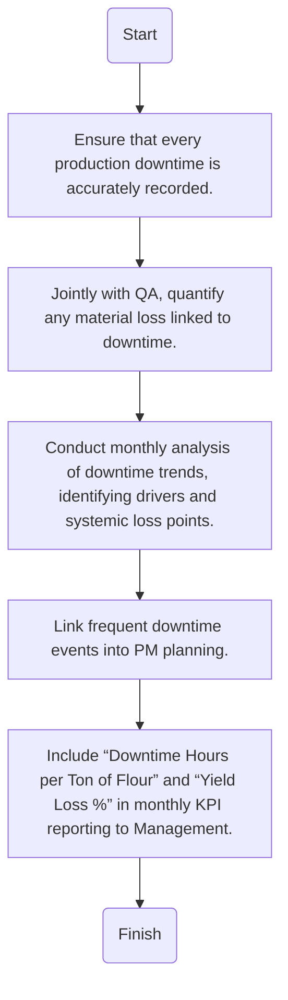

Here is the analysis of the flowchart:

### 1. Process Name
- Yield Optimization – Operational Downtime & Loss Analysis

### 2. Roles (Swimlanes)
- Production Supervisor
- QA
- Maintenance Planner
- Branch Manager

### 3. Steps Extracted into a Markdown Table

| Step # | Role                  | Action                                                                                     | Next Step/Logic                                                                                     |
|--------|-----------------------|--------------------------------------------------------------------------------------------|-----------------------------------------------------------------------------------------------------|
| 1      | Production Supervisor | Ensure that every production downtime is accurately recorded.                              | Jointly with QA, quantify any material loss linked to downtime.                                     |
| 2      | Production Supervisor | Jointly with QA, quantify any material loss linked to downtime.                            | Conduct monthly analysis of downtime trends, identifying drivers and systemic loss points.           |
| 3      | QA                    | Conduct monthly analysis of downtime trends, identifying drivers and systemic loss points. | Link frequent downtime events into PM planning.                                                      |
| 4      | Maintenance Planner   | Link frequent downtime events into PM planning.                                            | Include “Downtime Hours per Ton of Flour” and “Yield Loss %” in monthly KPI reporting to Management. |
| 5      | Branch Manager        | Include “Downtime Hours per Ton of Flour” and “Yield Loss %” in monthly KPI reporting to Management. | Finish                                                                                              |

### 4. Mermaid.js Code Block

