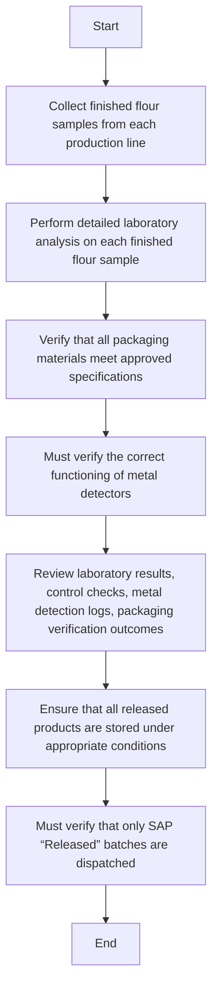

Certainly! Here's the analysis of the flowchart:

### 1. Process Name

Finished Products

### 2. Roles (Swimlanes)

- QA Analyst
- Packaging Line Operator
- QA Manager
- Warehouse Section Head

### 3. Steps in Markdown Table

| Step # | Role                  | Action                                                                                              | Next Step/Logic                                                                 |
|--------|-----------------------|-----------------------------------------------------------------------------------------------------|---------------------------------------------------------------------------------|
| 1      | QA Analyst            | Collect finished flour samples from each production line                                            | Step 2                                                                          |
| 2      | QA Analyst            | Perform detailed laboratory analysis on each finished flour sample                                  | Step 3                                                                          |
| 3      | QA Analyst            | Verify that all packaging materials meet approved specifications                                     | Step 4                                                                          |
| 4      | Packaging Line Operator | Must verify the correct functioning of metal detectors                                              | Step 5                                                                          |
| 5      | QA Manager            | Review laboratory results, control checks, metal detection logs, packaging verification outcomes     | Step 6                                                                          |
| 6      | Warehouse Section Head| Ensure that all released products are stored under appropriate conditions                            | Step 7                                                                          |
| 7      | Warehouse Section Head| Must verify that only SAP “Released” batches are dispatched.                                         | End                                                                             |

### 4. Logic in Mermaid.js

This provides a detailed breakdown of the flowchart process.