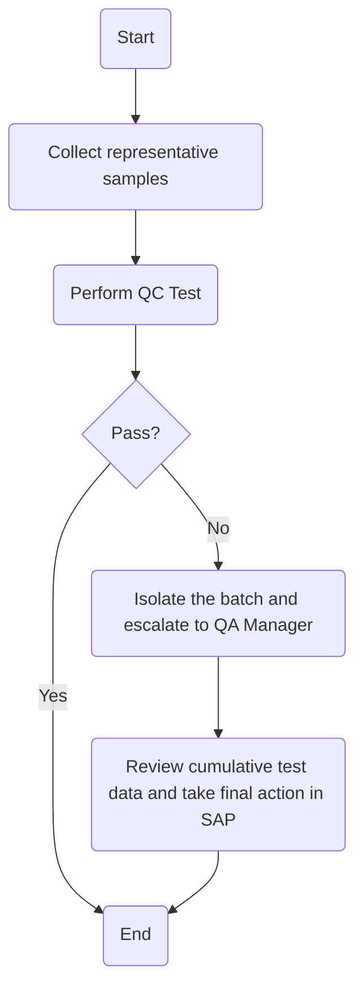

### Analysis

1. **Process Name**: Raw Wheat Receipt into Silos

2. **Roles (Swimlanes)**:
   - QA Analyst
   - QA Manager

3. **Steps Table**

| Step # | Role       | Action                                                      | Next Step/Logic                     |
|--------|------------|-------------------------------------------------------------|-------------------------------------|
| 1      | QA Analyst | Start                                                       | Collect representative samples      |
| 2      | QA Analyst | Collect representative samples                              | Perform QC Test                     |
| 3      | QA Analyst | Perform QC Test                                             | Pass?                               |
| 4      | QA Analyst | Pass? (Decision)                                            | Yes: End, No: Isolate batch         |
| 5      | QA Analyst | Isolate the batch and escalate to QA Manager                | Review cumulative test data         |
| 6      | QA Manager | Review cumulative test data and take final action in SAP    | End                                 |

4. **Mermaid.js Code Block**

